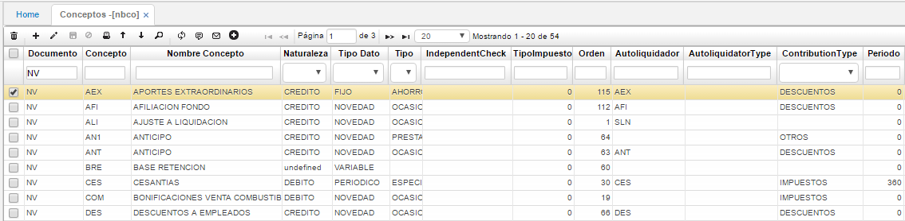
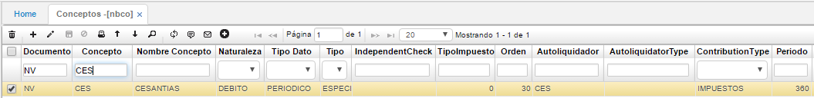
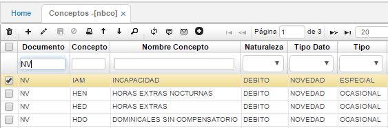
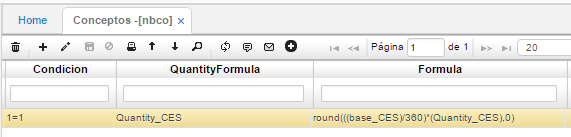

# CONCEPTOS - NBCO

La parametrización de los conceptos es el eje principal del funcionamiento de la nómina y requiere un especial cuidado, ya que, aquí se definen todos los aspectos a tener en cuenta en la liquidación de una nómina.

Para adicionar un concepto se utiliza el icono (**+**) correspondiente en la barra de herramientas, luego se procede a completar la información solicitada en cada columna y por último, se debe guardar dicha información. A continuación, se explica el significado de cada columna.

**Documento:** En el módulo de nómina existen tres clases de documentos (nómina, aportes y provisiones), los cuales se crean al ejecutar el proceso de generación de nómina, los conceptos deben estar asociados a algunos de estos documentos.  
**Concepto:** Letras y números que identifican cada concepto, es conveniente resaltar que este código debe ser único.  
**Nombre:** Nombre específico de cada concepto.  
**Naturaleza:** Los conceptos pueden ser débitos, créditos o no tener naturaleza. Los conceptos variables dependen para su cálculo de otros conceptos que pueden causar su inclusión o exclusión de algún tipo de nómina, este tipo de concepto se utiliza para calcular valores provisionales durante el proceso de generación de la nómina con el fin de simplificar la formulación de otros conceptos.  
**Tipo:** Corresponde al tipo periódico, se asigna a los conceptos que se cancelan con cierta periodicidad como: Primas, cesantías, etc. Cuando se define un concepto de este tipo además hay que indicar los días del periodo.  
**Orden:** Este orden es la forma en que el procedimiento de generación de nómina comienza a evaluar cada concepto, es indispensable que los conceptos involucrados en el cálculo de otro concepto se encuentren en un orden inferior a este.  
**Autoliquidador:** Iníciales que identifican al concepto de autoliquidación, van asociadas según el concepto y son utilizadas en el proceso que genera la autoliquidación de aportes.  
**Tipo Autoliquidador:** Hace referencia al concepto por el cual se hace la auto liquidación ya sea por novedad, aporte o descuento.  
**Tipo Aporte:** Hace referencia al concepto por el cual se hace el aporte. A continuación, las diferentes clases.  
**Periodo:** Hace referencia al periodo en el cual serán calculados los conceptos de tipo periódico.  

Los conceptos parametrizados como novedad se deben ingresar para el cálculo de la nómina por medio de la opción novedades **NNOV - Novedades**. Existen diferentes tipos de novedades las cuales se pueden consultar en la aplicación **NBCO – Conceptos** filtrando por documento (_NV Novedades_).

Todos los conceptos deben llevar una condición, una cantidad y una fórmula para su cálculo.

**Condición:** es una agrupación de características que deben cumplirse para que el concepto sea calculado y aplicado. Si el concepto va a ser aplicado a todos los empleados se ingresa la condición 1=1, de lo contrario se tiene que ingresar la condición específica.  
**Cantidad:** Indica cuanto tiempo se va a liquidar en cada concepto, pueden ser horas, días o valores específico tomados del procedimiento de generación de nómina. En algunos casos esta cantidad solo cumple una función informativa, esta cantidad aparece en el detalle de la nómina.  
**Formula:** Indica la manera de calcular el concepto, en el caso de las novedades debe llevar un 1, para que aplique el valor de la novedad.  

