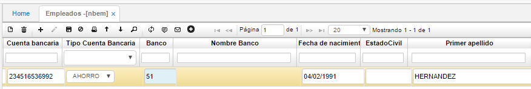
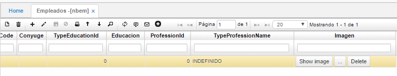
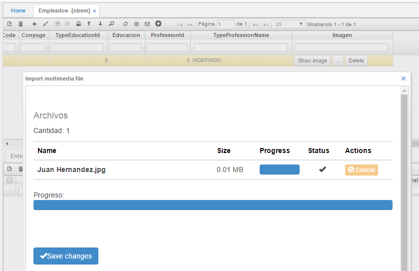
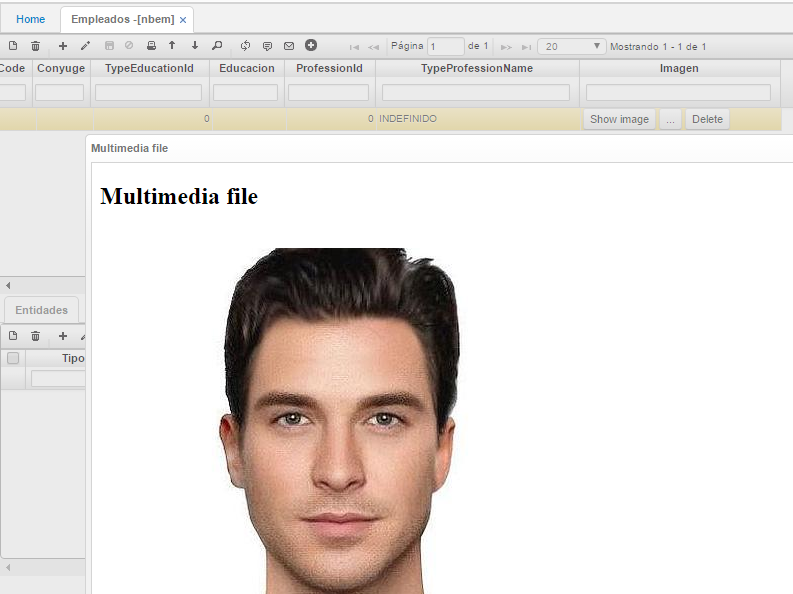
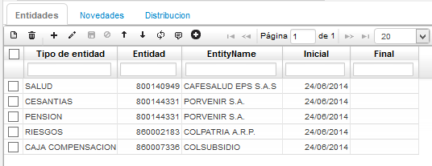

# EMPLEADOS - NBEM

Esta aplicación se divide en maestro y detalle:

_Maestro_:  
En el maestro se debe consultar por número de documento de identidad del empleado y editar los campos de cuenta bancaria, tipo de cuenta bancaria y banco. Estos campos son importantes al momento de generar el pago de la nómina por archivo plano.

La opción **NBEM - Empleados** cuenta con la posibilidad de adicionar una imagen (Fotografía) en cada uno de los registros de empleado que se adicionen, esta opción se encuentra en la columna imagen.

Damos clic en el botón con los tres puntos (…) y el sistema traerá una ventana del servidor local para escoger la imagen que se desea cargar, al seleccionarla mostrará la siguiente ventana indicando que la imagen se cargó, para guardar los cambios damos clic en el botón _Save changes_.

Para ver la foto cargada damos clic en el botón _Show image_.

_Detalle_:  
_Pestaña Entidades_:

En esta pestaña se registran los datos de las entidades donde se encuentra afiliado el empleado y las fechas en que permaneció o permanece afiliado.

Para asignar estas entidades deben estar previamente creadas en la opción BTER - Básico de terceros, en donde se encuentran relacionados todos los datos de los terceros asociados a la organización.

Para que los empleados puedan observarse en esta aplicación deben estar creados en la opción BTER, indicando que son empleados y a que empresa pertenecen.

