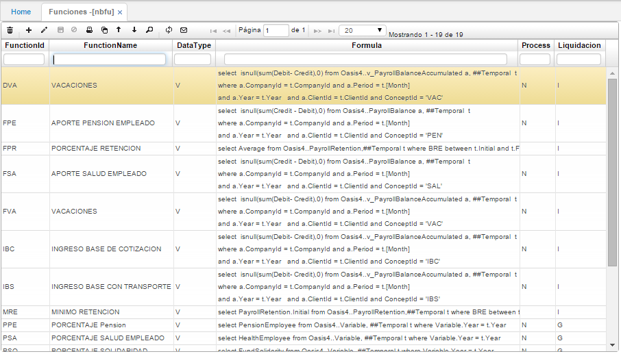

# FUNCIONES - NBFU

En esta opción se parametrizan las funciones que van a ser utilizadas para la recuperación de algunos valores insertados en **VARIABLES AÑO (NBVA)**, además se pueden llamar valores acumulados en otras tablas.

	Consta de seis columnas que se describen a continuación:
    
**Id Función.** Letras (tres) que identifican el concepto.  
**Nombre.** Nombre específico del concepto.  
**Tipo Dato.** Hace referencia a la característica del tipo de dato si es de valor String, Numérico, entre otros.  
**Fórmula.** Se refiere a la fórmula aplicada en la función del concepto. Evaluar después de la condición que se aplica a cada concepto para su liquidación.  
**Liquidación:** Hace referencia a como se va a liquidar el concepto si es en forma individual o general.  
