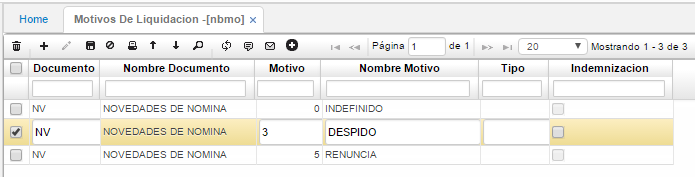

# MOTIVOS DE LIQUIDACIÓN - NBMO

En esta opción se incluyen los motivos por los cuales puede ser liquidado un trabajador, este motivo en caso de liquidación es necesario incluirlo en la novedad de retiro.

**Documento:** documento con el cual se relacionará el motivo.  
**Motivo:** número de motivo asignado al documento. Los motivos deben estar previamente parametrizados en la opción **BMOT** para el documento _NV_.

