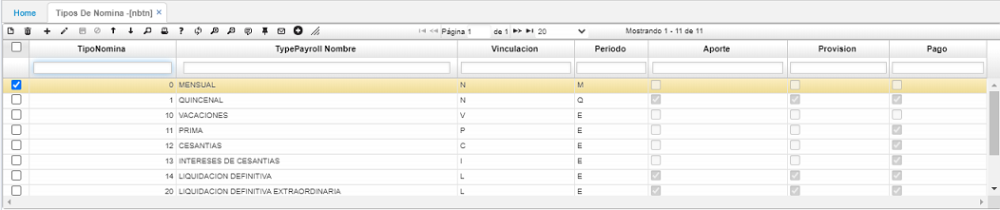
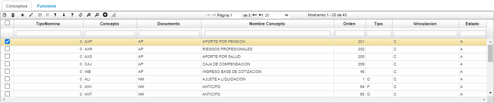
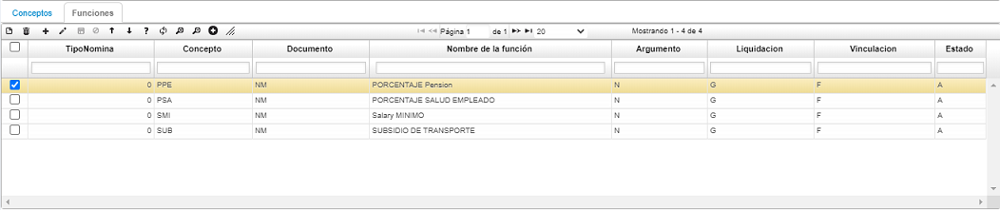

# TIPOS DE NÓMINA - NBTN  

* [**Parametrización de los tipos de nómina**](http://docs.oasiscom.com/Operacion/hrm/nomina/nbasica/nbtn#parametrización-de-los-tipos-de-nómina)   

En esta opción es posible incluir los tipos de nómina necesarios en el proceso.

**Tipo Nómina:** Identificación de tipo de Nómina.  
**Nombre:** Nombre especifico del tipo de nómina.  
**Vinculación:** Inicial predeterminada para el tipo de nómina.  
**Periodo:** Inicial que identifica al periodo de liquidación de la nómina puede ser quincenal (Q) o mensual (M).  
**Aportes:** Si aplica o no al tipo de nómina en su liquidación.  
**Provisión:** Si aplica o no al tipo de nómina en su liquidación.  
**Pago:** Si aplica o no al tipo de nómina en su liquidación.

Cada tipo de nómina lleva asociados algunos de los conceptos creados en la opción **NBCO - Conceptos**, para incluir un concepto en algún tipo de nómina, es necesario ubicarse en el respectivo tipo de nómina y en el detalle de esta incluir el código del concepto y guardar los cambios.

## [**Parametrización de los tipos de nómina**](http://docs.oasiscom.com/Operacion/hrm/nomina/nbasica/nbtn#parametrización-de-los-tipos-de-nómina)    

En esta aplicación se parametrizan todos los tipos de nómina.  En el campo _Tipo de nómina_ se diligencian todos los tipos de nómina. Hay que resaltar que el código no se debe repetir porque el sistema arrojará de inmediato una alerta de error.  El siguiente campo es _Nombre del tipo de nómina_, en este se diligencia el nombre del tipo de nómina que se está parametrizando; luego, sigue el campo _Vinculación_, en este campo se diligencia la inicial predeterminada para cada tipo de nómina; en el campo _Periodo_, se diligencia la inicial que identifica el periodo de la liquidación de la nómina, que sería **_Q_** de quincenal o **_M_** de mensual o **_E_** si es un tipo de nómina especial; el campo _Aporte_, se diligencia teniendo en cuenta si aplica o no al tipo de nómina en su liquidación; el campo _Provisión_, de igual manera se diligencia si aplica o no al tipo de nómina y el campo _Pago_, también varía dependiendo del tipo de nómina.  

  

En la parte inferior, hay una pestaña llamada _Conceptos_.  en este campo, se deben agregar los conceptos que se desean calcular para ese tipo de nómina, los registros se pueden agregar para los 3 tipos de documentos (AP - aportes parafiscales, NM - nómina y PV - provisiones). El concepto se debe parametrizar en la aplicación **Conceptos - NBCO**; los campos _Documento_, _Orden_, _Tipo_ y _Estado_, se diligencian automáticamente.  En el campo _Tipo_, se puede observar una letra **_O_** que hace referencia a _Ocasionales_ o una letra **_F_** que hace referencia a _Fijos_.

  

Enseguida de la pestaña _Conceptos_, existe otra pestaña llamada _Funciones_.  En esta pestaña, se agregan las funciones a calcular para el tipo de nómina deseado, estas funciones se definen en la opcion **Funciones - NBFU** y al agregarlas en NBTN se debe indicar el tipo de documento para el cual se desea calcular (AP - aportes parafiscales, NM - Nómina y PV - provisiones).  Aquí solo se valida que exista la funcion en NBFU pero no se valida el documento.  

  

A continuación, se debe ingresar a la aplicación **Programación - NPRO**(http://docs.oasiscom.com/Operacion/hrm/nomina/nbasica/npro) para continuar con el proceso de la nómina.

