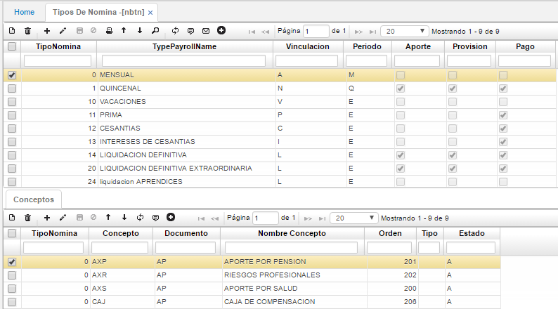

# TIPOS DE NÓMINA - NBTN

En esta opción es posible incluir los tipos de nómina necesarios en el proceso.

**Tipo Nómina:** Identificación de tipo de Nómina.  
**Nombre:** Nombre especifico del tipo de nómina.  
**Vinculación:** Inicial predeterminada para el tipo de nómina.
**Periodo:** Inicial que identifica al periodo de liquidación de la nómina puede ser quincenal (Q) o mensual (M).
**Aportes:** Si aplica o no al tipo de nómina en su liquidación.  
**Provisión:** Si aplica o no al tipo de nómina en su liquidación.  
**Pago:** Si aplica o no al tipo de nómina en su liquidación.

Cada tipo de nómina lleva asociados algunos de los conceptos creados en la opción **NBCO - Conceptos**, para incluir un concepto en algún tipo de nómina, es necesario ubicarse en el respectivo tipo de nómina y en el detalle de esta incluir el código del concepto y guardar los cambios.

