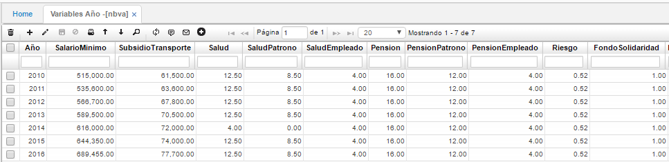

# VARIABLES AÑO

En esta opción se insertan los datos alusivos a cada año, entre estos tenemos los siguientes:  

**Año:** Año al cual se hace referencia.  
**Salario Mínimo:** Remuneración mínima a la cual tiene derecho una persona al estar laborando.  
**Subsidio Transporte:** Valor que reconoce la empresa al trabajador para ayuda de transporte.  
**Salud:** Porcentaje que se aporta al régimen de salud.  
**Salud Patrono:** Porcentaje aportado por parte del empleador al régimen de salud.  
**Salud Empleado:** Porcentaje aportado por parte del empleado al régimen de salud.  
**Pensión:**  Porcentaje que se aporta al fondo de pensiones.  
**Pensión Patrono:**  Porcentaje aportado por parte del empleador al fondo de pensiones.  
**Pensión Empleado:** Porcentaje aportado por parte del empleado al fondo de pensiones.  
**Riesgo:**  Hace referencia cuando una empresa solo tiene que asegurar a sus empleados a una entidad de protección de riesgos.  
**Fondo Solidaridad:**  Porcentaje que se aporta al fondo de solidaridad.  
**Tope Fondo Solidaridad:** Monto máximo aportado al fondo de solidaridad.  
**Días Vacaciones:** Número de días a descansar por periodo de tiempo laborado. Formula: (Días laborados * Salario mensual básico) / 720.  
**SENA:** Porcentaje que se aporta al Sena.  
**Caja Compensación:** Porcentaje que se aporta a la caja de compensación.  
**ICBF:** Porcentaje que se aporta al ICBF.  
**Fondo Salud:** Porcentaje aportado al fondo de salud.  
**Fondo ARL:** Porcentaje aportado a la aseguradora de riesgos profesionales.  
**Salario Máximo:** Número de salario máximo sobre el cual se calcula la base de retención.  
**Salario Integral:** Salario sobre el cual se calcula la base de retención en los anteriores aspectos.  
**Interés Mora:** Porcentaje cobrado por mora.  
**Patrimonio:** Campo que se emplea para la expedición de certificados.  
**Ingresos:** Campo que se emplea para la expedición de certificados.  
**Inicio periodo:** Campo de fecha que se emplea para la expedición de certificados.  
**Fin Periodo:** Campo de fecha que se emplea para la expedición de certificados.  
**UVT:** Valor Unidad de Valor Tributario.

