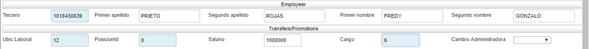
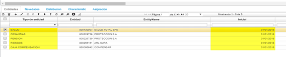

# Contratos de Nómina - NCNT

Terminado el proceso de Selección, se procede a crear el Contrato por Nómina para la persona seleccionada.  En esta opción se ingresan datos importantes de los empleados para la empresa. Se debe adicionar un nuevo registro en el maestro con los datos requeridos.  

- [Terceros BTER](http://docs.oasiscom.com/Operacion/hrm/nomina/nbasica/ncnt#terceros-bter)  
- [Novedades NNOV](http://docs.oasiscom.com/Operacion/hrm/nomina/nbasica/ncnt#novedades-nnov)  
- [Contratos NCNT](http://docs.oasiscom.com/Operacion/hrm/nomina/nbasica/ncnt#contratos-ncnt)  
- [Empleados NBEM](http://docs.oasiscom.com/Operacion/hrm/nomina/nbasica/ncnt#empleados-nbem)  
- [Control de acceso a la aplicación por turnos](http://docs.oasiscom.com/Operacion/hrm/nomina/nbasica/ncnt#control-de-acceso-a-la-aplicaci%C3%B3n-por-turnos)  

El proceso de ingreso de empleados inicia desde el registro del tercero, continua con la creación de la novedad de INGRESO y termina definiendo los detalles del contrato y entidades del empleado.  

## [Terceros BTER](http://docs.oasiscom.com/Operacion/hrm/nomina/nbasica/ncnt#terceros-bter)  

En esta aplicación parametrizamos o registramos todos los terceros que podemos tener, para el sistema Oasis la palabra terceros se hace referencia a: empleados, clientes, proveedores, afiliados, vendedores, asociados, entre otros. Es decir, todas las personas que interactÚan o se relacionan con nuestro negocio.  

1.	Registrar Tercero través de **TERCEROS (bter)**  
  a)	Abrir el programa bter  
  b)	Dar clic en agregar (+), ingresar los datos correspondientes al empleado y marcar el check  de (empleado)  
  c)	Guardar.  

## [Novedades NNOV](http://docs.oasiscom.com/Operacion/hrm/nomina/nbasica/ncnt#novedades-nnov)  

En esta aplicación se ingresan los conceptos que han sido creados como novedades, es importante diferenciar los tipos de novedades (recordemos que los conceptos ya se mencionaron en datos básicos en la opción NBCO - Conceptos).  

2.	Registrar novedad a través de Novedades (nnov)  
  a)	Abrir el programa nnov  
  b)	Dar clic en agregar (+), en la sección “basic” ingresar los campos Documento (NV), Ubicación (1), Concepto (ING), Fecha (día de ingreso), Fecha final (dejar en blanco).  

  c)	En la sección “Employeer” ingresar los campos Tercero (Identificación del empleado)  
  d)	En la sección “Transfers/Promotions” adicional la información correspondiente a la Ubicación Laboral, PosicionId, Salario y Cargo.  
  e)	Guardar documento y procesar novedad.  
  
  
  
Al procesar la novedad se creará automáticamente el contrato en la opción NCNT.

## [Contratos NCNT](http://docs.oasiscom.com/Operacion/hrm/nomina/nbasica/ncnt#contratos-ncnt)  

En esta opción se ingresan datos importantes de los empleados para la empresa. Se debe crear una nueva fila en el maestro con los datos requeridos.  
Documento: documento KN - Contratos de nómina. Documentos parametrizados en la opción BDOC – Documentos.  
NÚmero: consecutivo asignado automáticamente por el sistema.  
Ubicación: nÚmero de ubicación de la empresa que registra el contrato.   
Tercero: nÚmero de identificación del empleado a quien se le realiza el contrato.   
Tipo de nómina: seleccionar del zoom el tipo de nómina correspondiente.  

3.	Registrar información adicional del contrato a través de Contratos (ncnt)    
  a)	Abrir el programa ncnt  
  b)	Buscar con la identificación del Tercero el nÚmero de contrato creado.  
  c)	En la sección “Detalle” asignar la información de Tipo Salario, TariffRisk (tarifa de riesgo) y Deducible Salud (Valor pagado por el empleado y que debe ser descontado al momento de calcular retención en la fuente).  
  d)	Guardar Cambios  
  
  
  
## [Empleados NBEM](http://docs.oasiscom.com/Operacion/hrm/nomina/nbasica/ncnt#empleados-nbem)  

**Maestro:**
Estos campos son importantes al momento de generar el pago de la nómina por archivo plano  
 
4.	Registrar información adicional del empleado a través de Empleados (nbem)  
a)	Abrir el programa nbem  
b)	Buscar con la identificación del Empleado.  
c)	En la sección “Maestro” asignar la información de Tipo de cuenta y Numero (En caso de usarse)  

 
 
En la sección “Detalle” ingresar la información correspondiente a las entidades a las cuales está afiliado el empleado, teniendo en cuenta el Tipo de Entidad, NIT Entidad y Fecha inicial, NO se debe ingresar fecha final.  

 

## [Control de acceso a la aplicación por turnos](http://docs.oasiscom.com/Operacion/hrm/nomina/nbasica/ncnt#control-de-acceso-a-la-aplicaci%C3%B3n-por-turnos)  

En la aplicación _NCNT_ se definirá el turno por defecto que tendrá el empleado.  

En el detalle de la aplicación se encuentra el campo _TurnId_ que indica cual es el turno por defecto del empleado, el default para este campo será cero.  

Para los turnos rotativos, es necesario realizar la programación que se explica en la aplicación.  
[**NPRT - Rotación de Turnos**](http://docs.oasiscom.com//Operacion/hrm/asistencia/nasistenci/nprt).  
--- 
*El sistema controla que si se ejecuta **NLIT** para un tercero empleado, coincida el tipo de nomina **NBTN** ingresado con el asociado al tercero en el contrato de nómina **NCNT**. Si se corre para todos los terceros se valida que la forma de pago coincida con la periocidad del tipo de nomina.  
Para el escenario donde los empleados (guardas) en **NBEM** se le parametriza la periocidad de forma de pago, si es mensual o quincenal; dependiendo del cliente donde esté prestando el servicio.  

  

Y en el contrato de nómina **NCNT** tiene asociado un tipo de nómina que indica, si es quincenal o mensual.  
  

El sistema realiza la siguiente validación:  

* Contrato de nómina VS periocidad de pago según donde preste el servicio.  

  

Desde la pre_liquidación [NLIT], ingresa turnos adicionales a los guardas que se paga la nómina por programación (valor fijo modelo turno).  

