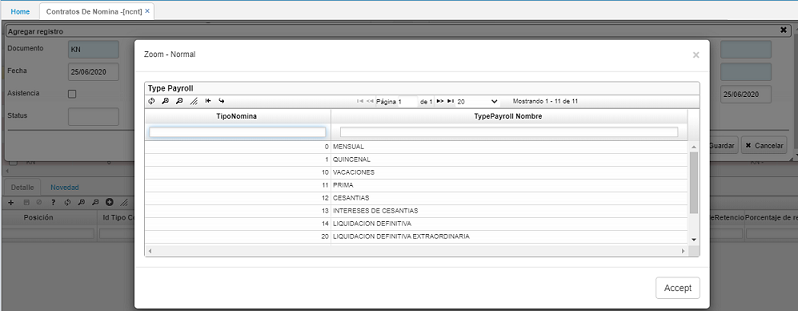
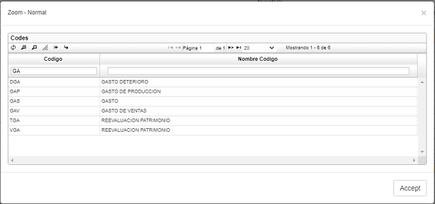
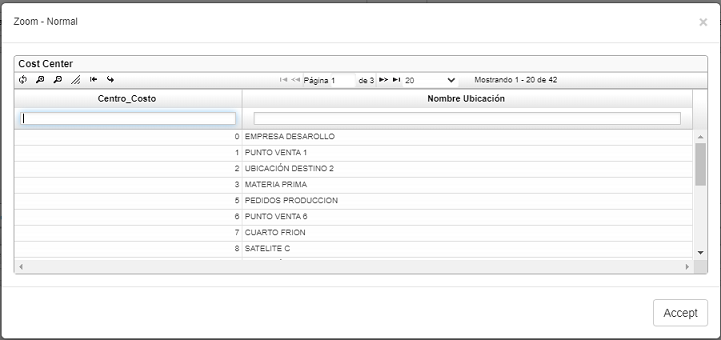
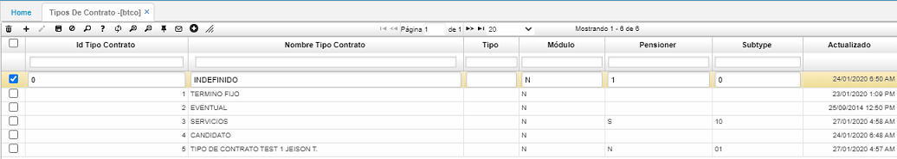
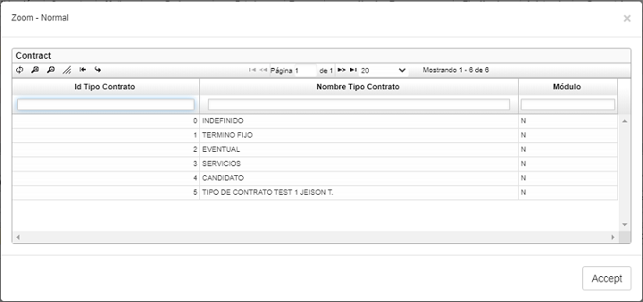
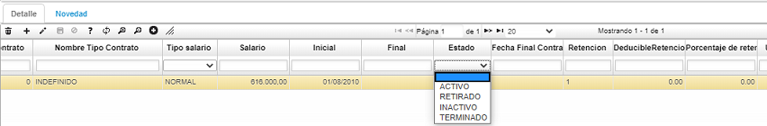

# CONTRATOS DE NÓMINA - NCNT

Terminado el proceso de Selección, se procede a crear el Contrato por Nómina para la persona seleccionada.  En esta opción se ingresan datos importantes de los empleados para la empresa. Se debe adicionar un nuevo registro en el maestro con los datos requeridos.  

**Documento:** documento _KN - Contratos de nómina_. Documentos parametrizados en la opción **Documentos - BDOC**.   
**Número:** consecutivo asignado automáticamente por el sistema.  
**Ubicación:** número de ubicación de la empresa que registra el contrato.  
**Concepto:** concepto _KN - Contratos de nómina_. Los conceptos también son parametrizables en la opción **Documentos - BDOC** en la pestaña _Conceptos_.  
**Tercero:** número de identificación del empleado a quien se le realiza el contrato.  
**Tipo de nómina:** seleccionar del zoom el tipo de nómina correspondiente.  Este campo también es parametrizable en la opción **Tipos de Nómina - NBTN**.  

Guardamos los datos ingresados en el maestro. En el detalle se deben diligenciar los datos correspondientes de acuerdo a lo firmado en el contrato con el empleado. Se adiciona un nuevo registro.  Los campos a diligenciar para el cálculo de la nómina son: _Ubicación laboral_, _Tipo de contrato_, Tipo Salario_, _Salario_, _Inicial_,  _Final_.  Los otros campos solo son informativos.  

**Cargo:** dar doble clic y seleccionar del Zoom el cargo que ocupará el nuevo empleado.   Los cargos se parametrizan previamente en la aplicación **Cargos - RCAR**.

**Ubicación laboral:** dar doble clic y seleccionar la ubicación laboral a la cual pertenecerá el empleado. Esta ubicación hace referencia a la cuenta que va ser afectada en el gasto. Parametrizar en la opción **BUBI – Ubicaciones Organización** en el campo _Tipo de gasto_.  

**Id Tipo Contrato:** en este campo hay un zoom donde podemos ar doble clic y seleccionar el tipo de contrato asignado al empleado nuevo. Tipos de contratos previamente parametrizados en la opción **BTCO – Tipos de contrato**.  

  

**Tipo de salario:** que se manejará con este empleado, es decir, si es normal se escribe la letra _N_, si es variable la letra _V_ y si es integral la letra _I_.  
**Salario:** digitar en números el valor del salario asignado al empleado sin puntos ni comas.  
**Inicial:** fecha inicial del contrato.  
**Final:** se diligencia automáticamente mediante una novedad de retiro realizada en la opción **NNOV - Novedades**.  
**Estado:** estado en el que se encuentra el empleado dentro de la compañía. Si el empleado se encuentra actualmente laborando en la empresa el estado será activo, de lo contrario, mediante la novedad de retiro el estado cambia a retirado.

**Centro Trabajo:** es el centro de trabajo (Workplace) solicitado  para algunos clientes cuya planilla integrada necesita este campo para la correcta parametrización.

  

Diligenciados estos campos, se guarda el registro y luego se procesa.  

Se recomienda que los primeros campos sean modificados mediante novedades y no de forma manual, existen novedades de retiro que automáticamente cambian en la opción **NCNT – Contratos de nómina** el estado del empleado, el tipo de nómina y la fecha de terminación. La ubicación actual también puede ser modificada mediante una novedad de traslado al igual que el sueldo con una novedad de variación de salario.  

Una vez creado el **Contrato de Nómina**, se procede a realizar la **Creación del empleado** en la aplicación **Empleados - NBEM**.  En esta aplicación no es necesario crear un nuevo registro debido a que el empleado ya debe estar creado en la aplicación **Terceros - BTER**, así que el sistema nos traerá automáticamente el registro al colocar en el campo _Tercero_ el código del tercero.  Los únicos campos que se deben editar son: _Forma de pago_, _Cuenta bancaria_, _Tipo de cuenta bancaria_ y _Banco_ (aquí encontramos un zoom con todos los bancos y se debe seleccionar el correspondiente.  Estos bancos están parametrizados en la aplicación **Bancos - BBAN**.  

Diligenciados estos campos, se guarda el registro y se pasa al detalle.  La primera pestaña es la de _Entidades_, en la cual se registran las entidades en las que está afiliado el tercero.  En la pestaña _Novedades_ se escribe el incremento salarial que tenga la persona. 

## [Control de acceso a la aplicación por turnos](http://docs.oasiscom.com/Operacion/hrm/nomina/nbasica/ncnt#control-de-acceso-a-la-aplicaci%C3%B3n-por-turnos)

En la aplicación _NCNT_ se definirá el turno por defecto que tendrá el empleado.  

En el detalle de la aplicación se encuentra el campo _TurnId_ que indica cual es el turno por defecto del empleado, el default para este campo será cero.  

Para los turnos rotativos, es necesario realizar la programación que se explica en la aplicación.  
[**NPRT - Rotación de Turnos**](http://docs.oasiscom.com//Operacion/hrm/asistencia/nasistenci/nprt).  
--- 
*El sistema controla que si se ejecuta **NLIT** para un tercero empleado, coincida el tipo de nomina **NBTN** ingresado con el asociado al tercero en el contrato de nómina **NCNT**. Si se corre para todos los terceros se valida que la forma de pago coincida con la periocidad del tipo de nomina.  
Para el escenario donde los empleados (guardas) en **NBEM** se le parametriza la periocidad de forma de pago, si es mensual o quincenal; dependiendo del cliente donde esté prestando el servicio.  

  

Y en el contrato de nómina **NCNT** tiene asociado un tipo de nómina que indica, si es quincenal o mensual.  
  

El sistema realiza la siguiente validación:  

* Contrato de nómina VS periocidad de pago según donde preste el servicio.  

  

Desde la pre_liquidación [NLIT], ingresa turnos adicionales a los guardas que se paga la nómina por programación (valor fijo modelo turno).  

