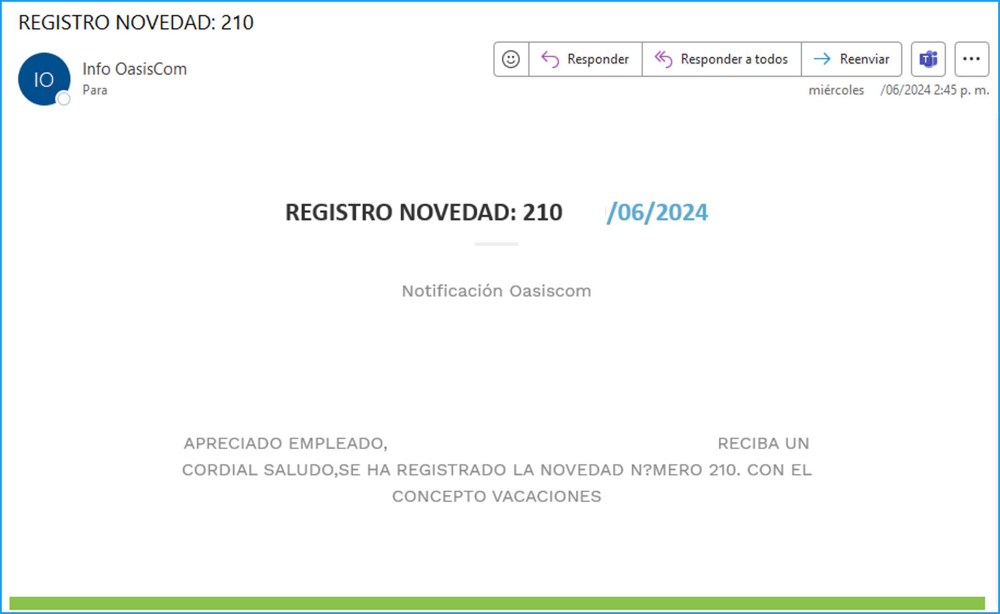
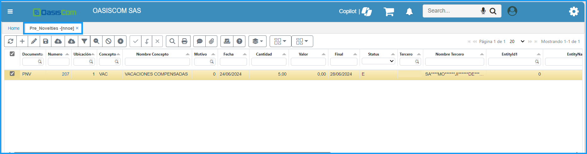
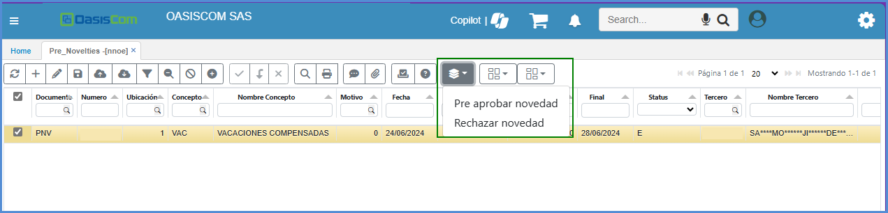
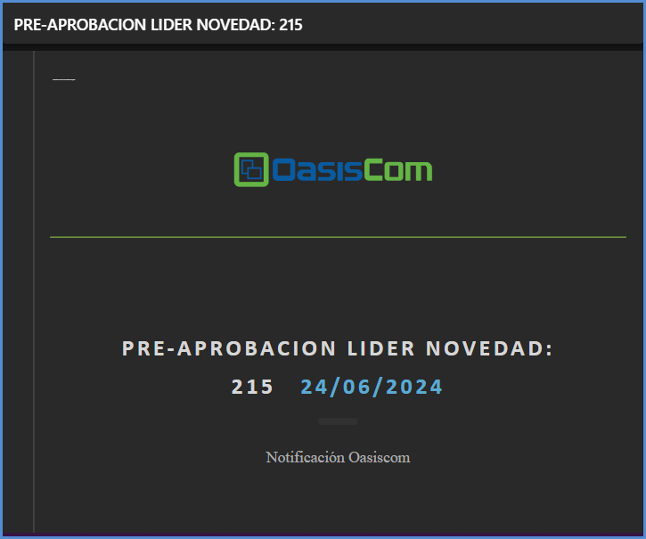
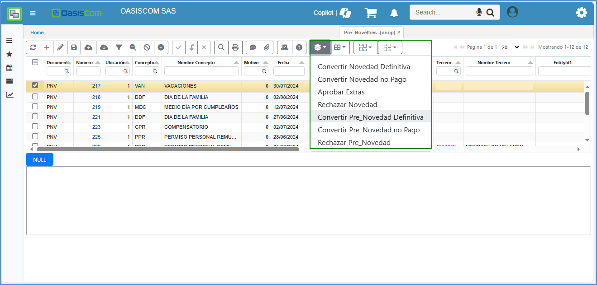
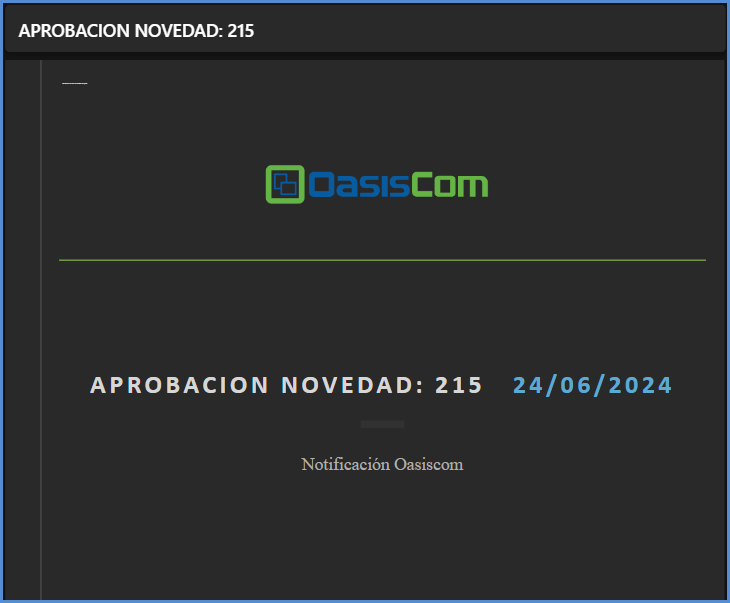
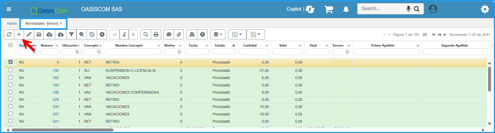
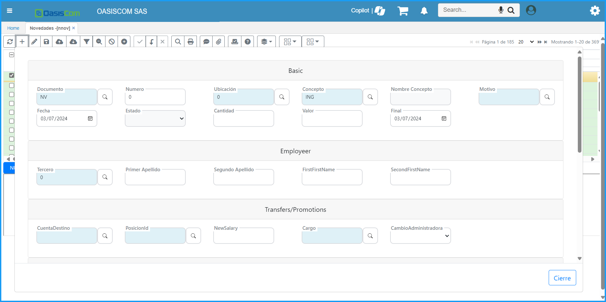
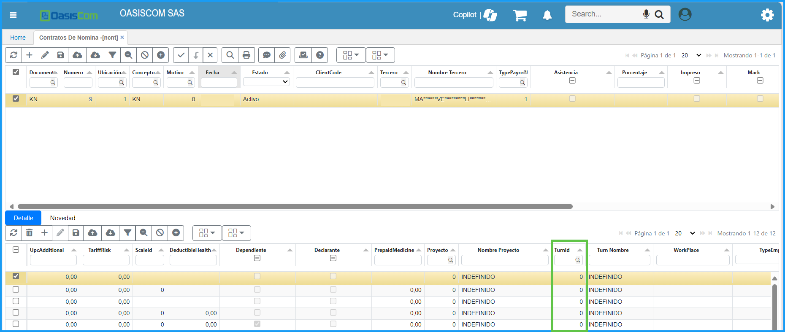

# Contratos de Nómina - NCNT

Terminado el proceso de Selección, se procede a crear el Contrato por Nómina para la persona seleccionada.  En esta opción se ingresan datos importantes de los empleados para la empresa. Se debe adicionar un nuevo registro en el maestro con los datos requeridos.  

- [Terceros - BTER](#terceros-bter)  
- [Pre-novedades - FNNOE](#pre-novedades-fnnoe) 
- [Pre-Novedades - NNOE](#pre-novedades-nnoe) 
- [Pre-Novedades - NNOP](#pre-novedades-nnop)
- [Novedades - NNOV](#novedades-nnov)   
- [Contratos - NCNT](#contratos-ncnt)  
- [Empleados - NBEM](#empleados-nbem)  
- [Control de acceso a la aplicación por turnos](#control-de-acceso-a-la-aplicaci%C3%B3n-por-turnos)  

El proceso de ingreso de empleados inicia desde el registro del tercero, continua con la creación de la novedad de INGRESO y termina definiendo los detalles del contrato y entidades del empleado.  

## [Terceros BTER](http://docs.oasiscom.com/Operacion/hrm/nomina/nbasica/ncnt#terceros-bter)  

En esta aplicación se parametriza o registra todos los terceros que se puede tener, para el sistema OasisCom. La palabra terceros se hace referencia a: empleados, clientes, proveedores, afiliados, vendedores, asociados, entre otros. Es decir, todas las personas que interactuan o se relacionan con el negocio.  

1.	Registrar Tercero través de la aplicación [**BTER - Terceros**](https://docs.oasiscom.com/Operacion/common/btercer/bter)   

2. Agregar un nuevo registro con el botón **Adicionar**

3. Una vez creado, en el detalle, se debe asignar el check que el tercero cumpla 

Y por último se guarda el registro.

## [Pre-novedades FNNOE](#pre-novedades-fnnoe) 

Está aplicación tiene como funcionalidad de crear registro de Pre-novedades por parte del empleado.

| Campos | Descripción |
| --- | ----------- |
| Documento | De acuerdo a la parametrización que se tiene, se veran reflejados en el Zoom de este campo. |
| Número | Automatico por el sistema |
| Ubicación| Ubicación donde se encuentren |
| Concepto| Se elige el concepto requerido según la pre-novedade parametrizado en la aplicación [**NBCO - Conceptos**](https://docs.oasiscom.com/Operacion/hrm/nomina/nbasica/nbco)|
| Nombre Concepto| El sistema trae automaticamente el nombre del concepto que se haya seleccionado.|
| Tercero| Número de documento del empleado que diligencia la pre-novedad|
| Fecha| Fecha inicial que se toma la novedad|
| Final| Fecha final de la novedad|
| Cantidad| Este campo es valido unicamente para ingresar la cantidad en días. |
| Observación| Se especifica  el motivo de la novedad de ser necesario y cantidad de tiempo. |

Una vez se guarda el registro, el sitema notifica por medio de correo electrónico al empleado y al rol que aprueba la Pre-Novedad.

## [Pre-Novedades - NNOE](#pre-novedades-nnoe)

Una vez creada la Pre-novedad en la aplicación [**Pre-novedades FNNOE**](#pre-novedades-fnnoe) el rol que aprueba la Pre-Novedad, podrá visualizar el registro en la aplicación **Pre-Novedades - NNOE**. Esta aplicación es para realizar una prea-aprobación de la Pre-novedad.

En caso de aprobar o rechazar se dirige al botón **Botones de Proceso** en donde se visualiza las opciones **Pre aprobar novedad** y **Rechazar novedad** y seleccionar la que corresponda. 

En caso de ser rechazada la **Pre-Novedad**, no se visualizará en la aplicación y de ser aprobada se vera el registro en la aplicación **Pre-Novedades - NNOP**.

Una vez pre-aprobada la **Pre-novedad** en la aplicación **Pre-Novedades - NNOE**  el sistema automáticamente envía un correo electronico, indicando que la Pre-novedad se **pre-aprobó**

## [Pre-Novedades - NNOP](#pre-novedades-ennop) 

En la aplicación [Pre-Novedades - ENNOP](#pre-novedades-ennop) este como ultimo paso es verificado por el rol encargado de las Pre-novedades y es la ultima verificación que realizan.

Una vez realizado este procedimiento se enviara nuevamente un correo notificando que la Pre-novedad ya ha sido aprobada oficialmente. 

## [Novedades NNOV](#novedades-nnov)  

En esta aplicación se visualizan los registros que han sido aprobados por los Jefes Inmediatos, unicamente es para validación. 

>**Nota:** Esta aplicación sirve para el Área Financiera, para registrar todas las novedades a la hora de hacer la nómina.

>**Importante:** Los datos se mencionan en la aplicación [**NBCO - Conceptos**](https://docs.oasiscom.com/Operacion/hrm/nomina/nbasica/nbco)

En caso de que alguna novedad, no se encuentre registrado la novedad que tuvo el empleado, esto se debe realizar manualmente.

Ejecutan el clic de **Adicionar** para crear el registro

 

Saldra el formulario a llenar, el cual debe ir la información correspondiente a la novedad.

  -	En la sección **Employeer** se ingresan los cadatos del Tercero.
  - En la sección “Transfers/Promotions” se ingresa información financiera.
  
  Una vez realizado esta información se guarda el registro

Esto se creara automaticamente en la aplicación **NCNT - Contratos de Nómina**

## [Contratos NCNT](#contratos-ncnt)  

En esta opción se ingresan datos importantes de los empleados para la empresa. 

Se debe crear una nueva fila en el maestro con los datos requeridos.  

| Campos | Descripción |
| --- | ----------- |
| Documento     | Documento KN - Contratos de nómina. Estos documentos son parametrizados en la aplicación [**BDOC - Documentos**]( https://docs.oasiscom.com/Operacion/common/bsistema/bdoc)  |
| Número        | consecutivo asignado automáticamente por el sistema.   |
| Ubicación     | Número de ubicación de la empresa que registra el contrato.|
| Tercero       | Número de identificación del empleado a quien se le realiza el contrato.|
| Tipo de nómina| seleccionar del zoom el tipo de Contrato. |

 Se registra la información adicional del contrato a través la aplicación **NCNT - Contratos**   

  - Abrir el programa **NCNT - Contratos** 
  - Buscar con la identificación del Tercero el número de contrato creado.  
  - En la sección “Detalle” asignar la información correspondiente del tercero. 
  - Una vez hecho esto, se guarda del botón del detalle 
  
  
  
## [Empleados NBEM](#empleados-nbem)  

En la sección **Maestro** en estos campos al momento de generar el pago de la nómina por archivo plano.
 
Se registra la información adicional del empleado a través de la aplicación **Empleados - NBEM**

- Abrir el programa **Empleados - NBEM**
- Buscar con la identificación del tercero.  
- En la sección **Maestro** se asigna la información de Tipo de cuenta y Número, en caso de hacer uso de este.
- En la sección **Detalle** se ingresa la información correspondiente a las entidades a las cuales está afiliado el empleado, teniendo en cuenta el Tipo de Entidad, NIT Entidad y Fecha inicial, NO se debe ingresar fecha final. 

 
 

## [Control de acceso a la aplicación por turnos](http://docs.oasiscom.com/Operacion/hrm/nomina/nbasica/ncnt#control-de-acceso-a-la-aplicaci%C3%B3n-por-turnos)  

En la aplicación [**Contratos - NCNT**](#contratos-ncnt)  se define el turno por defecto que tendrá el empleado.  

En el detalle de la aplicación se encuentra el campo _TurnId_ que indica cual es el turno por defecto del empleado, el default para este campo será cero.  

Para los turnos rotativos, es necesario realizar la programación que se explica en la aplicación.  
[**NPRT - Rotación de Turnos**](http://docs.oasiscom.com//Operacion/hrm/asistencia/nasistenci/nprt).  
 
El sistema controla que si se ejecuta **NLIT - Liquidaciones** para un tercero empleado, coincida el tipo de nomina [**NBTN - Tipos de Nómina**]( https://docs.oasiscom.com/Operacion/hrm/nomina/nbasica/nbtn).  

Ingresado con el asociado al tercero en el contrato de nómina [Contratos NCNT](#contratos-ncnt). Si se corre para todos los terceros se valida que la forma de pago coincida con la periocidad del tipo de nomina.  

Para el escenario donde los empleados [**NBTN - Tipos de Nómina**](https://docs.oasiscom.com/Operacion/hrm/nomina/nbasica/nbem) se le parametriza la periocidad de forma de pago, si es mensual o quincenal; dependiendo del cliente donde esté prestando el servicio.  

  

Y en el contrato de nómina **NCNT** tiene asociado un tipo de nómina que indica, si es quincenal o mensual.  

  

El sistema realiza la siguiente validación:  

* Contrato de nómina VS periocidad de pago según donde preste el servicio.  

Desde la aplicación **NLIT - Liquidaciones** , ingresa turnos adicionales a los guardas que se paga la nómina por programación (valor fijo modelo turno).  

