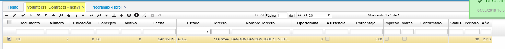
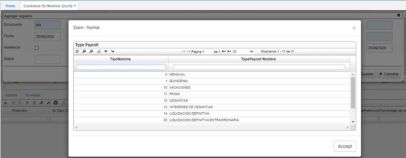
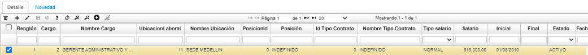
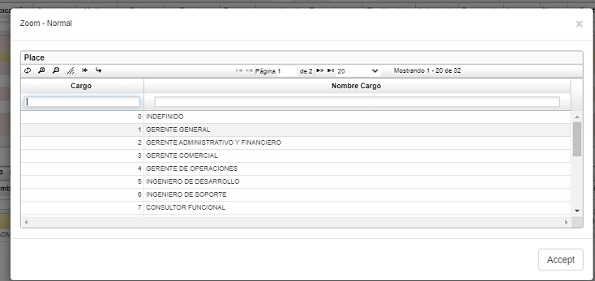
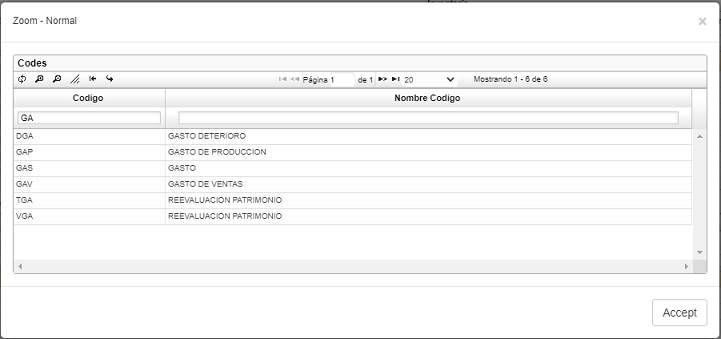
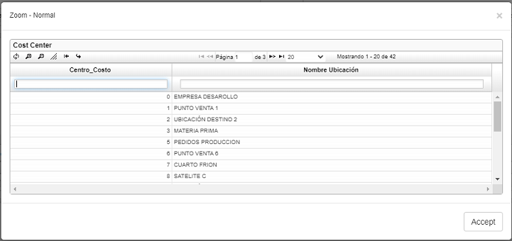
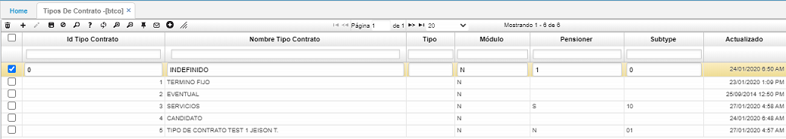
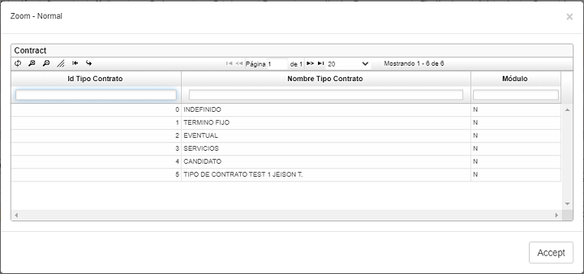
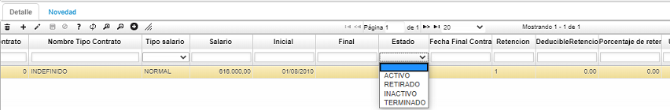
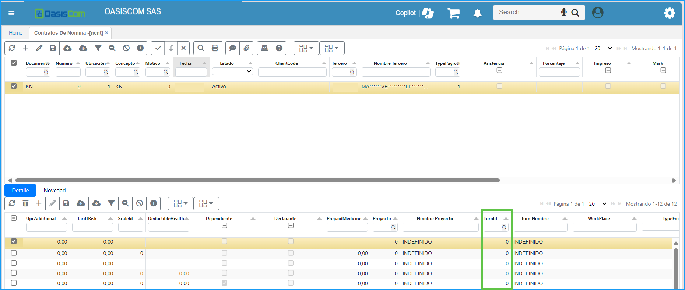

# VOLUNTEERS CONTRACTS - NCNV

En esta opción se ingresan datos importantes de los voluntarios para la empresa. Se debe crear una nueva fila en el maestro con los datos requeridos.  
Opción creada para registrar la información correspondiente a contratos de voluntarios.

**Documento:** Documentos parametrizados en la opción **BDOC – Documentos.**  
**Número:** consecutivo asignado automáticamente por el sistema.  
**Ubicación:** número de ubicación de la empresa que registra el contrato para voluntarios.  
**Concepto:** concepto por el cual se realiza el contrato para voluntarios. Los conceptos también son parametrizables en la opción **BDOC – Documentos** en la pestaña _Conceptos_.  
**Tercero:** número de identificación del empleado a quien se le realiza el contrato para voluntarios.  

Guardamos los datos ingresados en el maestro. En el detalle se deben diligenciar los datos correspondientes de acuerdo a lo firmado en el contrato con el empleado. Los campos a diligenciar para el cálculo de la nómina son (ubicación laboral, tipo de contrato, salario, final inicial, estado), otros solo son informativos.  

**Cargo:** dar doble clic y seleccionar del Zoom el cargo que ocupará el nuevo empleado.  

**Ubicación laboral:** dar doble clic y seleccionar la ubicación laboral a la cual pertenecerá el empleado. Esta ubicación hace referencia a la cuenta que va ser afectada en el gasto. Parametrizar en la opción **BUBI – Ubicaciones Organización** en el campo _ExpenseType_.  

**Id Tipo Contrato:** dar doble clic y seleccionar el tipo de contrato asignado al empleado nuevo. Tipos de contratos previamente parametrizados en la opción **BTCO – Tipos de contrato**.  

**Salario:** digitar en números el valor del salario asignado al empleado sin puntos ni comas.  
**Inicial:** fecha inicial del contrato.  
**Final:** se diligencia automáticamente mediante una novedad de retiro realizada en la opción **NNOV - Novedades**.  
**Estado:** estado en el que se encuentra el empleado dentro de la compañía. Si el empleado se encuentra actualmente laborando en la empresa el estado será activo, de lo contrario, mediante la novedad de retiro el estado cambia a retirado.  

Se recomienda que los primeros campos sean modificados mediante novedades y no de forma manual, existen novedades de retiro que automáticamente cambian en la opción **NCNT – Contratos de nómina** el estado del empleado, el tipo de nómina y la fecha de terminación. La ubicación actual también puede ser modificada mediante una novedad de traslado al igual que el sueldo con una novedad de variación de salario.  

## [Control de acceso a la aplicación por turnos](http://docs.oasiscom.com/Operacion/hrm/nomina/nbasica/ncnt#control-de-acceso-a-la-aplicaci%C3%B3n-por-turnos)

En la aplicación _NCNT_ se definirá el turno por defecto que tendrá el empleado.  

En el detalle de la aplicación se encuentra el campo _TurnId_ que indica cual es el turno por defecto del empleado, el default para este campo será cero.  

Para los turnos rotativos, es necesario realizar la programación que se explica en la aplicación [**NPRT - Rotación de Turnos**](http://docs.oasiscom.com//Operacion/hrm/asistencia/nasistenci/nprt).

