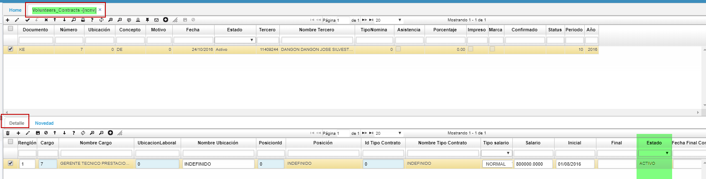

# VOLUNTEERS CONTRACTS - NCNV

En esta opción se ingresan datos importantes de los voluntarios para la empresa. Se debe crear una nueva fila en el maestro con los datos requeridos.  
Opción creada para registrar la información correspondiente a contratos de voluntarios.

**Documento:** Documentos parametrizados en la opción **BDOC – Documentos.**  
**Número:** consecutivo asignado automáticamente por el sistema.  
**Ubicación:** número de ubicación de la empresa que registra el contrato para voluntarios.  
**Concepto:** concepto por el cual se realiza el contrato para voluntarios. Los conceptos también son parametrizables en la opción **BDOC – Documentos** en la pestaña _Conceptos_.  
**Tercero:** número de identificación del tercero, a quien se le realiza el contrato para voluntarios.  

Guardamos los datos ingresados en el maestro.  
En el detalle se deben diligenciar los datos correspondientes de acuerdo a lo firmado en el contrato como Voluntario. Los campos a diligenciar para el cálculo de la nómina son (ubicación laboral, tipo de contrato, salario, final inicial, estado), otros solo son informativos.  

**Cargo:** dar doble clic y seleccionar del Zoom el cargo que ocupará el nuevo voluntario.  

**Ubicación laboral:** dar doble clic y seleccionar la ubicación laboral a la cual pertenecerá el tercero voluntario. Esta ubicación hace referencia a la cuenta que va ser afectada en el gasto. Parametrizar en la opción **BUBI – Ubicaciones Organización** en el campo _ExpenseType_.  

**Id Tipo Contrato:** dar doble clic y seleccionar el tipo de contrato asignado al tercero voluntario. Tipos de contratos previamente parametrizados en la opción **BTCO – Tipos de contrato**.  

**Salario:** digitar en números el valor del salario asignado al tercero voluntario sin puntos ni comas.  
**Inicial:** fecha inicial del contrato para el voluntario.  
**Final:** se diligencia automáticamente mediante una novedad de retiro realizada en la opción **NNOV - Novedades**.  
**Estado:** Estado en el que se encuentra el tercero voluntario dentro de la compañía. Si el voluntario se encuentra actualmente laborando en la empresa el estado será activo, de lo contrario, mediante la novedad de retiro el estado cambia a retirado.  

