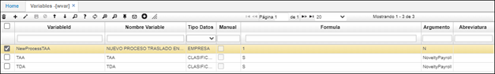
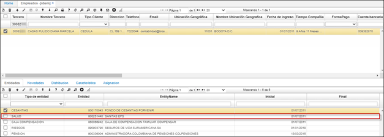
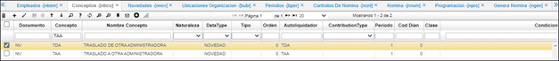
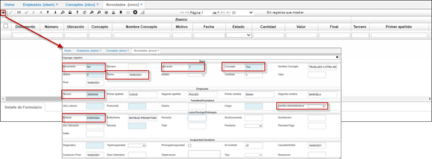
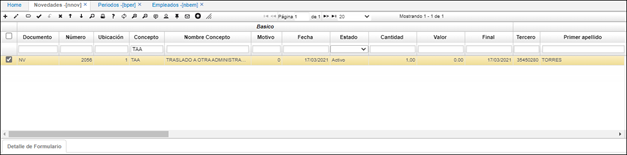
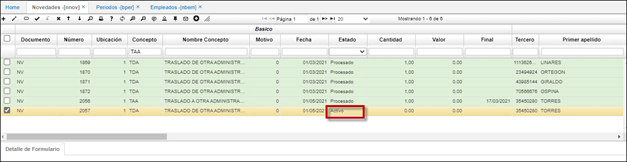
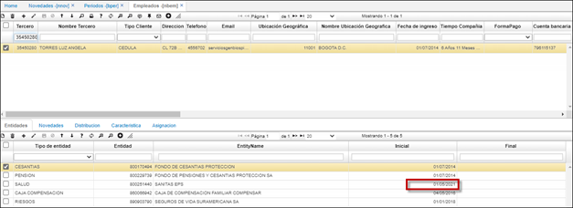

# Novedades - NNOV

En esta aplicación se ingresan los conceptos que han sido creados como novedades, es importante diferenciar los tipos de novedades (recordemos que los conceptos ya se mencionaron en datos básicos en la opción **NBCO - Conceptos**)   

1.[Novedades](https://docs.oasiscom.com/Operacion/hrm/nomina/nnovedad/nnov#novedades)   
1.1 [Novedad Traslado de entidad](https://docs.oasiscom.com/Operacion/hrm/nomina/nnovedad/nnov#novedad-traslado-de-entidad)  
1.1.1 [Aplicación WVAR](https://docs.oasiscom.com/Operacion/hrm/nomina/nnovedad/nnov#aplicación-wvar)  
1.1.2 [Aplicación NBEM](https://docs.oasiscom.com/Operacion/hrm/nomina/nnovedad/nnov#aplicación-nbco)  
1.1.3 [Aplicación NBCO](https://docs.oasiscom.com/Operacion/hrm/nomina/nnovedad/nnov#aplicación-nbco)  
1.1.4 [Aplicación NNOV](https://docs.oasiscom.com/Operacion/hrm/nomina/nnovedad/nnov#aplicación-nnov)  

* [**Novedades - NNOV**](http://docs.oasiscom.com/Operacion/hrm/nomina/nnovedad/nnov) 

    

## [Novedades](https://docs.oasiscom.com/Operacion/hrm/nomina/nnovedad/nnov#novedades) 
Para que una novedad sea tenida en cuenta en una nómina, su fecha debe estar comprendida en el periodo de programación de la nómina en la opción NPRO, o sea entre la fecha inicial y final de la nómina. Además, debe estar en estado procesado al momento de generar la nómina.

En la siguiente imagen podemos observar una novedad de retiro, donde son importantes los datos de fecha (fecha de retiro), número de identificación del empleado, documento _NV_ y concepto.

Las novedades de vacaciones se ingresan indicando los datos básicos (empleado, concepto) y fecha inicial. Esta fecha inicial debe ser la fecha en que se comienza a disfrutar de las vacaciones. La novedad se ingresa con la cantidad de días que va a disfrutar la persona, no se debe incluir el valor, este será calculado por el sistema.

En el momento de procesar la novedad, luego de haber guardado los cambios, el sistema calcula la fecha final del periodo de vacaciones teniendo en cuenta la cantidad de días ingresados y los días festivos que se presenten en el periodo de disfrute.

Para ello previamente deben estar definidos los días considerados festivos en la empresa en la opción **BFES**, como se indica a continuación.

## [Novedad Traslado de entidad](https://docs.oasiscom.com/Operacion/hrm/nomina/nnovedad/nnov#novedad-traslado-de-entidad)   

El siguiente manual se crea de acuerdo con el decreto 806 de 1998 Art 56 – Decreto 1406 de 1999 Art 42, con la necesidad de realizar el cambio de una entidad administradora como lo son las entidades de salud y pensión, por medio de una novedad en OasisCom.   

### [Aplicación WVAR](https://docs.oasiscom.com/Operacion/hrm/nomina/nnovedad/nnov#aplicación-wvar)    

Se debe verificar que existan las variables TAA, TDA y NewProcessTAA.  

  

### [Aplicación NBEM](https://docs.oasiscom.com/Operacion/hrm/nomina/nnovedad/nnov#aplicación-nbco)    

Basado en el tercero el cual se realizará el cambio de entidad, es importante que antes de realizar cualquier cambio, se valide en que entidad se encuentra el tercero, para ello se debe ingresar a la aplicación NBEM – Empleados. (COMPLEMENTAR: solo debería existir una entidad de cada una por empleado, esta entidad debería tener vacío el campo Final).  

### [Aplicación NBCO](https://docs.oasiscom.com/Operacion/hrm/nomina/nnovedad/nnov#aplicación-nbco)    

En esta aplicación se debe validad que los conceptos TAA y TDA se encuentre parametrizado en la aplicación NBCO – Conceptos.  

### [Aplicación NNOV](https://docs.oasiscom.com/Operacion/hrm/nomina/nnovedad/nnov#aplicación-nnov)  

Posteriormente de identificar los pasos anteriores, se debe ingresar a la aplicación NNOV – Novedades se debe adicionar un nuevo registro y diligenciar el formulario correspondiente.   

- **Documento:** El tipo de Documento a realizar en este caso NV (Novedad).   
- **Ubicación:** La ubicación por la cual se realizará la novedad, éstas son parametrizadas en la aplicación BUBI - Ubicaciones Organización. (COMPLEMENTAR: las ubicaciones en novedades siempre deben ser 1).    
- **Concepto:** El concepto por el cual se realizará, para este caso el concepto debe ser TAA.  
- **Fecha:** La fecha en que regirá la novedad es importante tener en cuenta que basada en la fecha en que se llevará el conteo la novedad se debe hacer a una fecha con dos meses menos, como se puede validar en nuestro ejemplo el traslado queremos hacerlo efectivo para el 16/08/2021, por eso se realizó con fecha de 16/06/2021 (dos meses menos) esto como normativa se da un periodo de 60 días para el cambio. (COMPLEMENTAR: el cambio siempre deber el primer día hábil teniendo en cuenta que el cambio aplica el primer día del 2 mes siguiente al mes en que solicita el traslado).    
- **Tercero:** Empleado al cual se le realiza la novedad.   
- **Cambio Administradora:** Según corresponda, en este caso es salud. (COMPLEMENTAR: este cambio aplica para entidades SALUD y PENSION, para las demás entidades no se creará novedad automática con auto liquidador TDA).     
- **Entidad:** El NIT de la entidad a la cual será cambiada, en este caso Sanitas EPS a Famisanar. La entidad se parametriza en la aplicación BTER - Terceros.    

Una vez guardado, se crea el nuevo registro con la novedad creada.    

Al procesar las novedades TAA se crean automáticamente una novedad con auto liquidador TDA relacionando en el campo DocNumberId el numero de la novedad original, estas novedades quedan en estado activo con fecha del primer día del segundo mes siguiente a la novedad TAA, estas novedades solo pueden procesarse al momento de ser autorizado el traslado por la entidad y con la fecha respectiva notificada por la entidad.  

  

Al momento de procesar la novedad TDA se afectará la entidad en la aplicación NBEM – Empleado.   

  

