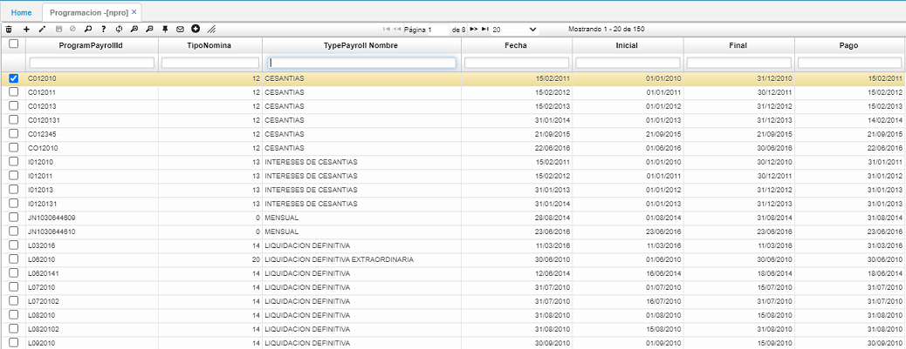

# PROGRAMACIÓN - NPRO

En esta opción se define la programación de pago de nómina, el campo de código puede ser elegido por el usuario a conveniencia, pero una vez creado algún tipo de código se debe continuar con esta misma estructura. También se define el tipo de nómina que se va a liquidar y las fechas inicial y final de la misma, así como la fecha de pago.

Se aconseja programar las nóminas de Vacaciones, Liquidación Definitiva y Normal para cada periodo según sea el caso.

_Nota: La programación de las nóminas especiales como cesantías, intereses de cesantías y primas se hace en esta misma opción, indicando los parámetros en las fechas. Una vez programada la nómina en el NPRO se genera de igual manera que una nómina normal en la opción NGEN con los parámetros programa y tercero._

