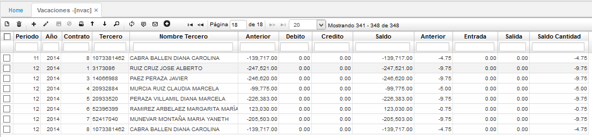

# VACACIONES - NVAC

Esta tabla se encarga de almacenar los datos de todas las provisiones y novedades de vacaciones que se han ingresado en el sistema, es decir, de los periodos causados y disfrutados por los empleados, igualmente se pueden ver los días pendientes por disfrutar. En esta tabla se cargan los datos iníciales de las vacaciones causadas para cada empleado mediante un documento _PV - Provisión_. A continuación, un ejemplo.

