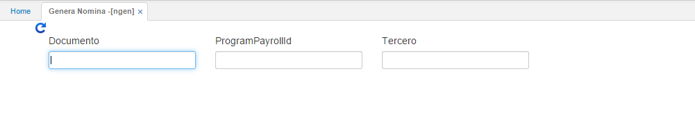

# GENERA NÓMINA - NGEN

Esta opción despliega una ventana, donde se debe incluir tres datos específicos. El programa que se va a generar, recordemos que este programa debe estar previamente creado en la opción **NPRO – Programación**, aplicación donde se crean los programas para los diferentes tipos de nóminas que se vayan a generar, ya sea quincenal, mensual o liquidaciones.

En el campo Documento, se ingresa el tipo de documento que se vaya a generar (_NM - Nómina, AP - Aportes, PV - Provisión_). En el campo _ProgramPayrollId_ se ingresa el nombre del programa con el cual se creó en la opción **NPRO – Programación**, por último, en el campo tercero se debe incluir el número de documento del empleado si se desea generar para una sola persona o el número cero (0), si se va a generar la nómina para todos los empleados.

Una vez se genera este proceso, se crea automáticamente el documento respectivo (_NM, AP_o _PV_) en la aplicación **NNOM**, se debe tener en cuenta que un mismo programa se puede generar cuantas veces sea necesario siempre y cuando la nómina se encuentre en estado Activo, al hacerlo el sistema reemplaza la nómina existente que cumple con esas condiciones. Cuando la nómina se revisa y es aprobada debe ser procesada. De esta manera se garantiza que no se pueda volver a generar ya que el sistema enviará un mensaje indicando que ya existe una nómina procesada.  

Es importante resaltar que, para poder generar una nómina el periodo respectivo debe estar abierto en la opción **BPER - Periodos**.

