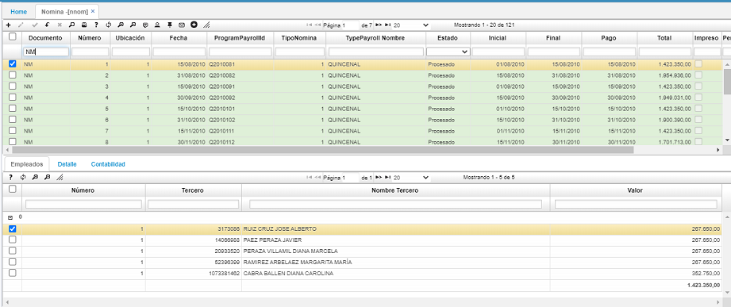
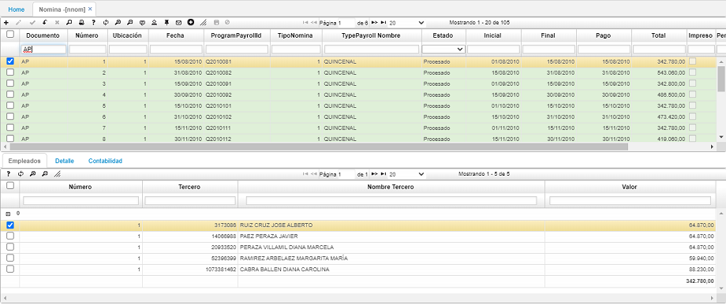
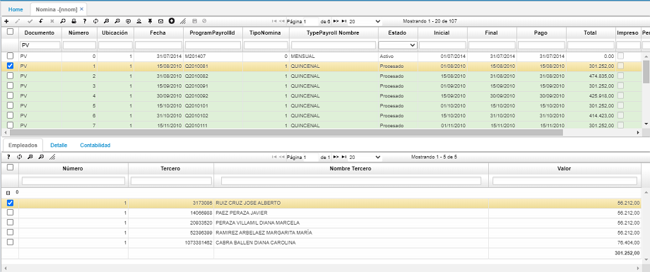
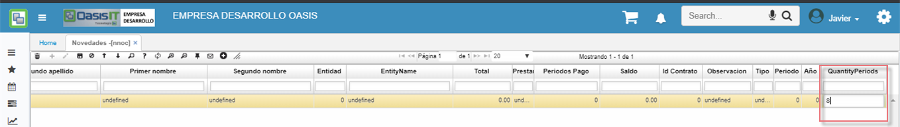

# NÓMINA - NNOM

Esta es la aplicación que almacena las nóminas que han sido generadas en la opción **NGEN – Genera Nómina**, al igual que muchos documentos en Oasis pueden tener tres estados (activo, procesado, anulado), ya sabemos que una nómina en estado activo puede volver a generarse.

El proceso de generación de nómina insertará tres documentos en cada generación, un documento _NM - Nómina_ donde se pueden observar los valores devengados y deducidos por cada empleado, un documento _AP – Aportes_, en el cual se almacenan los conceptos de aportes a seguridad social y parafiscales, finalmente un documento _PV – Provisión_, el cual contiene las provisiones de nómina para cada periodo. Se debe tener en cuenta que para generar los documentos _AP_ y _PV_ es necesario que los documentos _NM_ se encuentren en estado procesado, de lo contrario no traerá datos. A continuación, se muestran imágenes con los tres tipos de documentos generados.

**•**	Documento _NM - Nómina_

**•**	Documento _AP - Aportes_

**•**	Documento _PV - Provisión_

Para los tres documentos, en la pestaña Detalle se puede ver los conceptos discriminados por empleado. En esta última Imagen se observa el detalle del documento _PV – Provisión_.

# Cuotas en Novedades - NNOC

Esta opcion permite la modificacion solamente de la columna **QuantityPeriods**, en el cual se podra ubicar en la novedad requerida, modificar el registro y guardar de forma sencilla.

