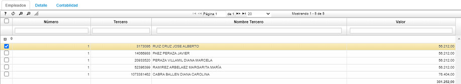
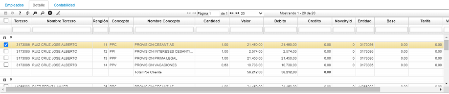

# NÓMINA - NNOM

Esta es la aplicación que almacena las nóminas que han sido generadas en la opción **NGEN – Genera Nómina**, al igual que muchos documentos en Oasis pueden tener tres estados (activo, procesado, anulado), ya sabemos que una nómina en estado activo puede volver a generarse cuantas veces sea necesario, al hacerlo, el sistema reemplazará la nómina existente.  Cuando la nómina se revisa y es aprobada, debe ser procesada; de esta manera garantizamos que no se pueda volver a generar ya que el sistema arroja un mensaje de control diciendo que la nómina ya fue procesada.  En el maestro también se encuentran los campos _Inicial_, _Final_, _Pago_ y _Total_(pago total de la nómina).

El proceso de generación de nómina insertará tres documentos en cada generación, un documento _NM - Nómina_ donde se pueden observar los valores devengados y deducidos por cada empleado, un documento _AP – Aportes_, en el cual se almacenan los conceptos de aportes a seguridad social y parafiscales, finalmente un documento _PV – Provisión_, el cual contiene las provisiones de nómina para cada periodo. Se debe tener en cuenta que para generar los documentos _AP_ y _PV_ es necesario que los documentos _NM_ se encuentren en estado procesado, de lo contrario no traerá datos. A continuación, se muestran imágenes con los tres tipos de documentos generados.

**•**	Documento _NM - Nómina_

**•**	Documento _AP - Aportes_

**•**	Documento _PV - Provisión_

Para los tres documentos, en la pestaña Detalle se puede ver los conceptos discriminados por empleado. En esta última Imagen se observa el detalle del documento _PV – Provisión_.  

En la parte inferior encontramos 3 pestañas.  La primera pestaña es _Empleados_, en ella encontramos el campo _Número_ que hace referencia al código del maestro, el campo _Tercero_, o sea a quien se genera la nómina y el _Valor_ por el cual se generó.  En la pestaña _Detalle_, se encuentra el Tercero dependiendo si la nómina se genera para una sola persona o para toda la empresa.  Si la nómina se genera mensual, aparece una fila con cada aporte generado, por ejemplo, salud, pensión, caja de compensación, salario básico.  Todos esos datos los trae el sistema automáticamente, partiendo de la parametrización que cada tercero tenga.

  

  

# Cuotas en Novedades - NNOC

Esta opcion permite la modificacion solamente de la columna **QuantityPeriods**, en el cual se podra ubicar en la novedad requerida, modificar el registro y guardar de forma sencilla.

