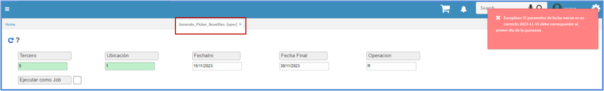

# Generar Novedades Recolección - NPNR

Generación de novedad quincenal en nómina según parámetros del registro del café en cereza que se registra en el OREC - Recolectores de Café y se puede visualizar en el opción **OCDP - Diarias por Productor por Finca y Recolector**. 

Se ingresa a la aplicación **OREC - Recolectores de Café**, donde contiene información de los documentos RK que se crea sobre el **OREC - Recolectores de Café**. Estos documentos deben estar creados sobre el mes que se genera las novedades. A continuación, el ejemplo, donde se utiliza novedades que están registradas.

Se ingresa a la aplicación **OCDP - Diarias por Productor por Finca y Recolector**, donde se visualiza la similitud de la información del OREC - Recolectores de Café.

Para realizar el proceso de generación de novedades por recolección, se ingresa a la aplicación **NPNR - Generar Novedades Recolección**, en el cual, en la aplicación se tendrá en cuenta lo siguientes parámetros: 

* **Tercero**: Puede generarse para un tercero puntual o para todos los terceros. 
* **Ubicación**: Por defecto siempre debe estar en 1. 
* **Fecha Inicial**: Rango de fecha correspondiente al primer día de la quincena, ya sea 01 o 16.
* **Fecha Final**: Rango de fecha correspondiente al último día de la quincena, ya sea 15, 30 o 31.
* **Operación**: Por defecto tendrá la letra R, lo cual significa **Recolección**.

  

El proceso va a validar, que los rangos de fechas son correctos, indicando que únicamente se puedan generar rangos de quincena. 

* Validación fechas del mismo mes 
 

* Validación parámetro final incorrecto 
 

 * Validación parámetro inicial incorrecto 
 

 * Validación rangos de fecha incorrectos
 

Cuando ya se ingresen los parámetros correctos el sistema indica que el proceso fue satisfactorio. 

En la aplicación **NNOP** se realiza la creación de **PRE – NOVEDADES**, al ejecutar el proceso, realiza el recalculo de las novedades ya existentes para cada recolector, una vez que se realice todas las recolecciones de la quincena de las **PRE – NOVEDADES**, podrán ser aprobadas mediante el botón **Convertir_Novedad_Definitiva** y generan un documento NV por concepto BOR (NV x BOR es una novedad por concepto de Bonificación por Recolección de Café).

El valor a generar de las novedades corresponde de las siguientes formulas: 

* Sumatoria del OCDP por recolector sea mayor al salario / 2
* PickerValue > (Salary/2)
* PickerValue - (Salary/2) = Genera Novedad
* Sumatoria del OCDP por recolector sea menor o igual al salario/2
* PickerValue <= (Salary/2)
0 (siendo un valor negativo) = No generara novedad

Al momento de ejecutar el botón, saldrá el registro exitoso.

Luego de generar las novedades definitivas se debe validar en el [NNOV - Novedades](https://docs.oasiscom.com/Operacion/hrm/nomina/nnovedad/nnov).

Si se genera nuevamente el proceso del **Generar Novedades Recolección - NPNR**, ya sea porque el recolector presento más documentos, el proceso suma los valores de la recolección y genera nuevamente las novedades del **NNOP- Pre_Novielties** con los nuevos valores y anula las registradas sobre el [NNOV - Novedades](https://docs.oasiscom.com/Operacion/hrm/nomina/nnovedad/nnov).

