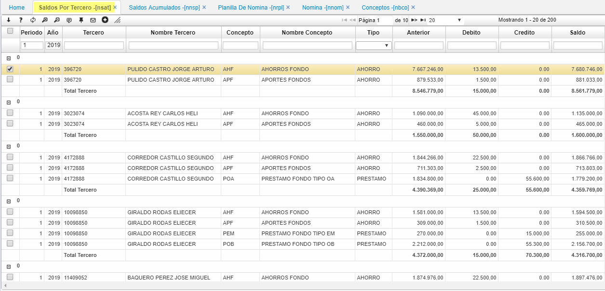
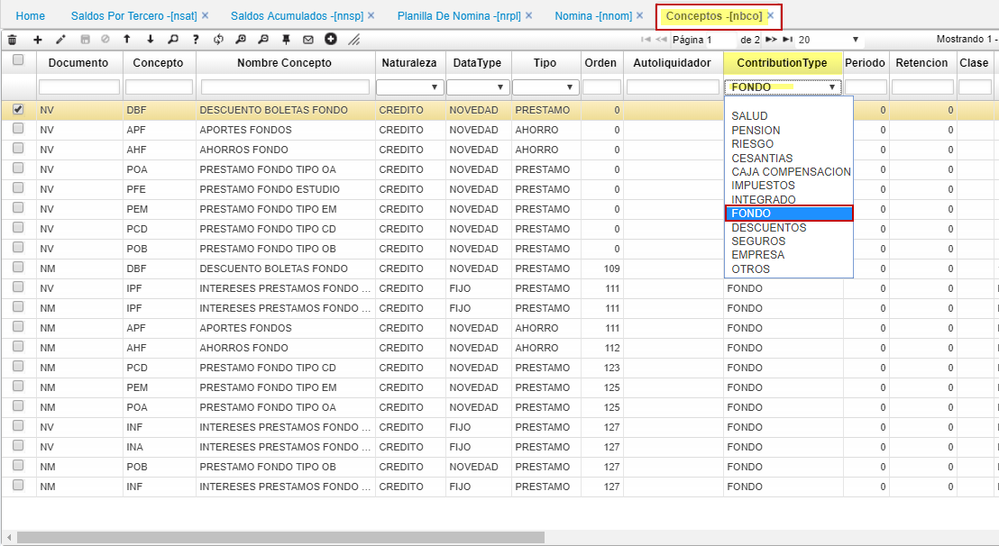

# SALDOS POR TERCERO - NSAT

Opción que muestra los acumulados de nómina por tercero del fondo de empleados.
La verificación de los conceptos tipo: fondo se validan en **NBCO** Básico de conceptos de nomina. 
** NSAT - Saldos por Tercero **.  
 

  

* NBCO. Conceptos de nómina - en el campo Contribution Type se filtra por FONDO.  
 
  

