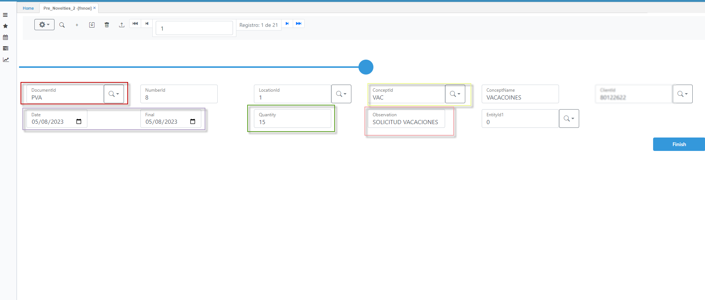
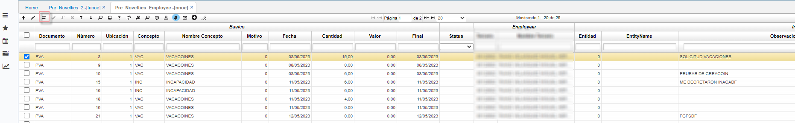
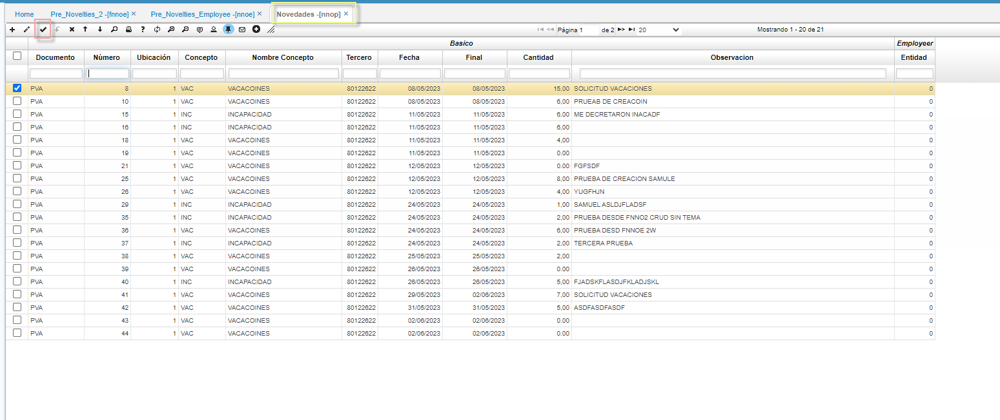

# AUTO REGISTRO DE NOVEDADES  - FNNOE 

Esta funcionalidad corresponde a la autogestión de novedades por parte del empleado, el objetivo de esta aplicación 
Es permitir a el empleado registrar una novedad para posteriormente ser aprobada por encargado aceptar la novedad
.

Para este proceso existe la aplicación **FNNOE - PRE NOVEDADES EMPLEADO** , en donde el empleado puede crear y ver novedades para
que posteriormente, sean aprobadas o no por parte del encargado.

En esta aplicación encontraremos la siguiente información: 

* Documento(rojo): Con este documento se registrar la novedad
* Concepto(Amarillo): En este campo se registra el tipo de novedad a solicitar (incapacidad, vacaciones, ausentismo etc...)
* Date(Morado): fecha inicial desde que aplica la novedad
* Final(Morado): fecha final en la que aplicara la novedad
* Quantity : Cantidad de días que aplicara la novedad
* observación: Algún tipo de información importante para la novedad 

Luego de registrar la novedad, esta inmediatamente será visible en la aplicación **NNOE - PRE NOVELTIEs CHIP** en donde el líder o encargado de aprobar esta novedad puede o no aprobarla para que esta sea validada por RRHH.

Si el líder decide aprobarla, esta pasara a la aplicación **NNOP NOVELTYES** , 
en Esta aplicación aparecerá únicamente las novedades que se encuentre aprobadas por el líder, 
Si el área de recursos humanos, decide aprobar definitiva la novedad, estas procesaran el documento y automáticamente, el sistema creara la novedad en la aplicación **NNOV NOVELTYES** para que finalmente el sistema tenga en cuenta esa novedad.

