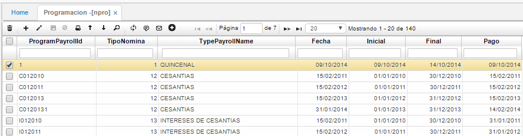
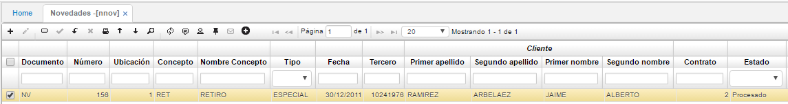
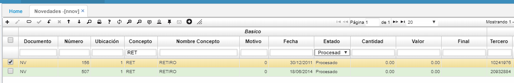

# NOVEDADES - NNOV

En esta aplicación se ingresan los conceptos que han sido creados como novedades, es importante diferenciar los tipos de novedades (recordemos que los conceptos ya se mencionaron en datos básicos en la opción **NBCO - Conceptos**).  

Para que una novedad sea tenida en cuenta en una nómina, su fecha debe estar comprendida en el periodo de programación de la nómina en la opción NPRO, o sea entre la fecha inicial y final de la nómina. Además, debe estar en estado procesado al momento de generar la nómina.  

En la siguiente imagen podemos observar una novedad de retiro, donde son importantes los datos de fecha (fecha de retiro), número de identificación del empleado, documento _NV_ y concepto.  

Las novedades de vacaciones se ingresan indicando los datos básicos (empleado, concepto) y fecha inicial. Esta fecha inicial debe ser la fecha en que se comienza a disfrutar de las vacaciones. La novedad se ingresa con la cantidad de días que va a disfrutar la persona, no se debe incluir el valor, este será calculado por el sistema.  

En el momento de procesar la novedad, luego de haber guardado los cambios, el sistema calcula la fecha final del periodo de vacaciones teniendo en cuenta la cantidad de días ingresados y los días festivos que se presenten en el periodo de disfrute.  

Para ello previamente deben estar definidos los días considerados festivos en la empresa en la opción **BFES**.  

* En el momento de registrar una novedad [**NNOV**] de retiro (RET) de un empleado y este contiene programación posterior a este fecha: el sistema realiza un borrado automático, no lo va a tener en cuenta.  

  

