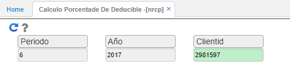
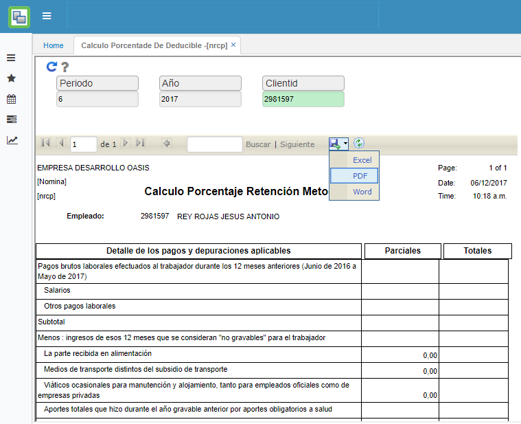
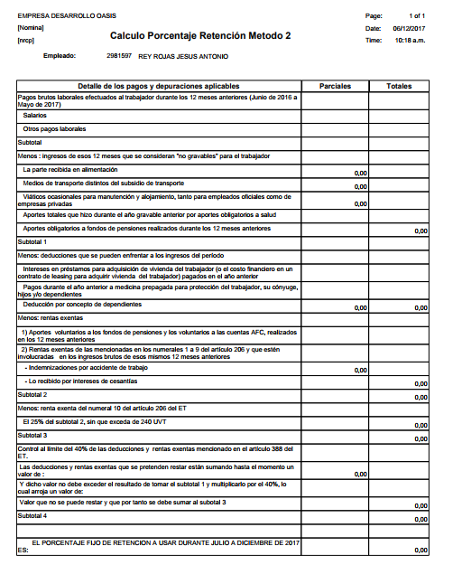

# NRCP - Cálculo Porcentaje de Deducible

La aplicación NRCP muestra un reporte con la información histórica de cálculo de retención en la fuente por cada trabajador.  

Ingresamos el mes, año y número de identificación del trabajador a consultar. Seguidamente damos click en el botón  para que el reporte sea generado.  

El reporte será generado de la siguiente manera. La aplicación cuenta con la opción de descargar el reporte en formato Excel, PDF o Word.  

Al descargar en formato PDF.  

