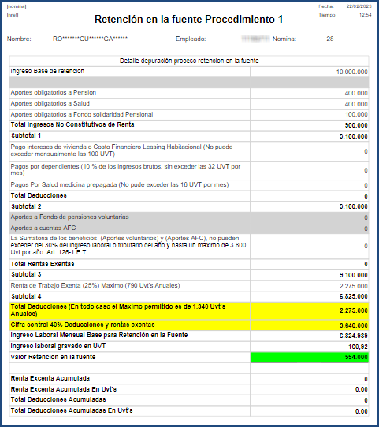

# Cálculo Retención en la Fuente - NREF

Este reporte permite visualizar la depuración del
proceso de Retención en la fuente realizado para
cada uno de los empleados en la nómina.

Para realizar la consulta se debe ingresar el
número de nómina calculada y el número de
identificación del empleado.

Al dar clic en el botón generar el reporte se
muestra toda la depuración que hizo el sistema
para llegar al cálculo de la retención en la
fuente del empleado.

