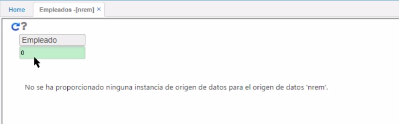
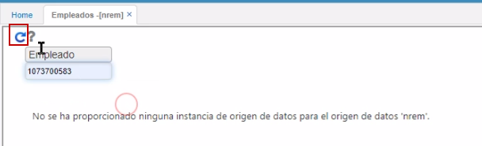

# Empleados - NREM  

En esta aplicación, se pueden ver todos los datos básicos de los empleados que hay en nuestra nómina.  

  

Se puede hacer una consulta de forma general (0) o una consulta específica por número de cédula.  Este reporte nos muestra datos importantes de los empleados tales como: número de documento de identificación, nombre del empleado, número de contrato con el que fue creado en el sistema, cargo actual, fecha de ingreso, sueldo y desde cuándo está con ese sueldo y fecha de nacimiento.  

