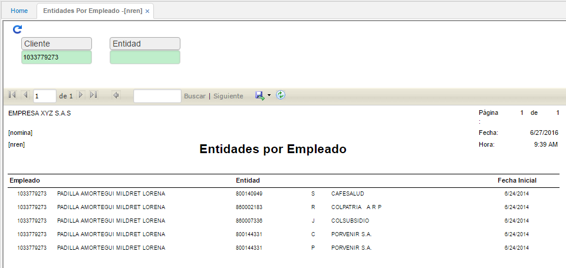

# ENTIDADES POR EMPLEADO - NREN

Este reporte muestra las entidades que tienen asociadas cada empleado, indicando la fecha en que ingreso a la entidad y el código respectivo.

Se filtra por número de identificación del empleado.

