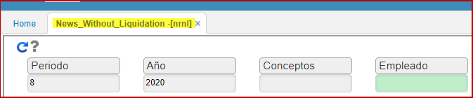

# Novedades sin Liquidar - NRNL

Reporte **NRNL**, el cual retorna todas las novedades que no están incluidas en una liquidación de nómina, adicional se verifica si el retiro tiene una nómina de liquidación pertinente.  

Parámetros de entrada:  
Periodo, año, conceptos, empleado.  

