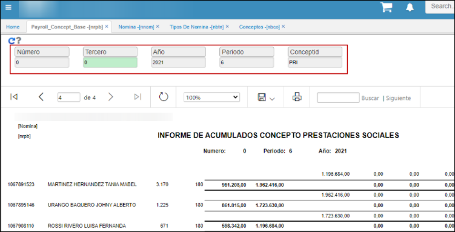

# Informe acumulado Concepto Prestaciones Sociales - NRPB  

Se ingresa a la opción NRPB que recibe parámetros de entrada número que corresponde a la nómina en caso de que sea liquidación definitiva, campo tercero que corresponde al empleado, año y periodo corresponde al año y periodo de generación y concepto que corresponde a los conceptos a calcular.   

