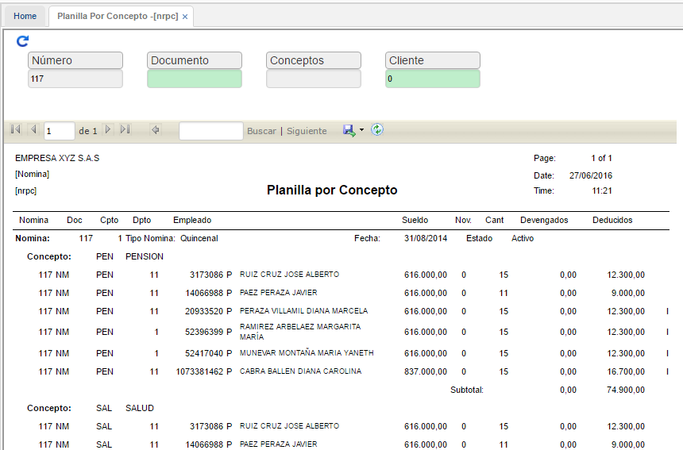

# PLANILLA POR CONCEPTO - NRPC

En esta opción se pueden hacer consultas agrupadas por los diferentes conceptos creados en la opción **NBCO - Conceptos**. Filtramos en el campo número, el número de nómina a consultar, el concepto de consulta y si se desea ver por un empleado en específico, en el campo cliente diligenciamos el número de identificación del mismo.

