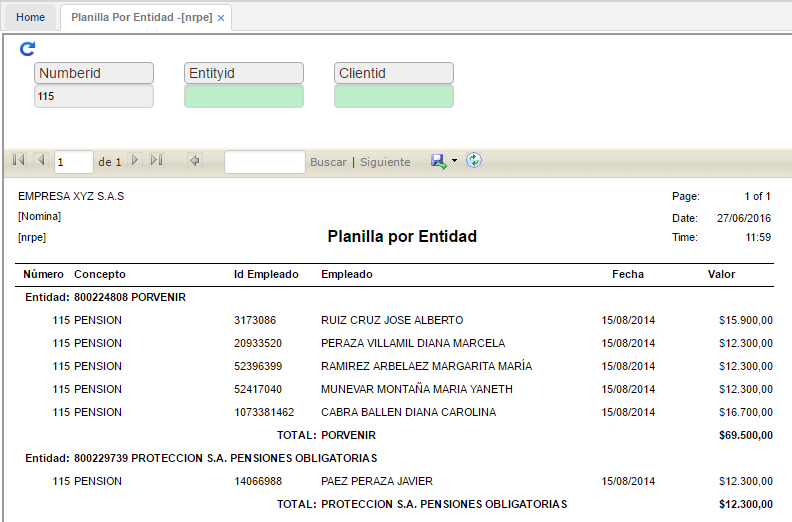

# PLANILLA POR ENTIDAD - NRPE

Esta opción permite realizar consultas sobre los conceptos que involucran las entidades asociadas empleados. Filtramos en el campo número por número de nómina. Si se desea ingresamos el nit de la entidad y el número de identificación del empleado.  

