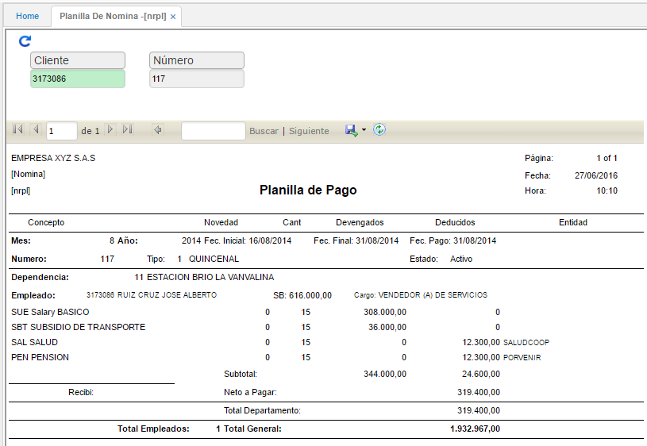

# PLANILLA DE NÓMINA - NRPL

En este reporte se pueden consultar las nóminas, validando el número de la nómina para darnos un reporte preliminar de las nóminas liqudiadas; se pueden consultar los valores devengados y deducidos para cada empleado, permite consultar para todos los empleados digitando el número 0 en el campo cliente o si la consulta es para un empleado en específico, se digita el número de identificación; en el campo _número_ digitamos el número respectivo de la nómina, dicho número es el consecutivo asignado en la aplicación **NNOM – Nómina** documento _NM_.

