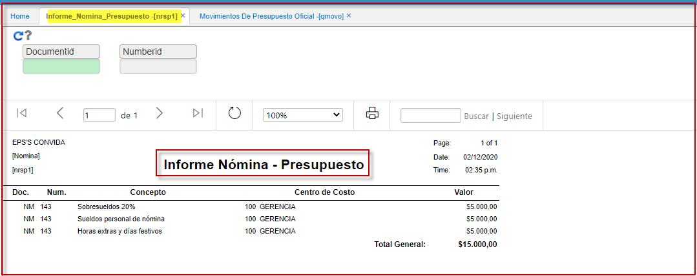
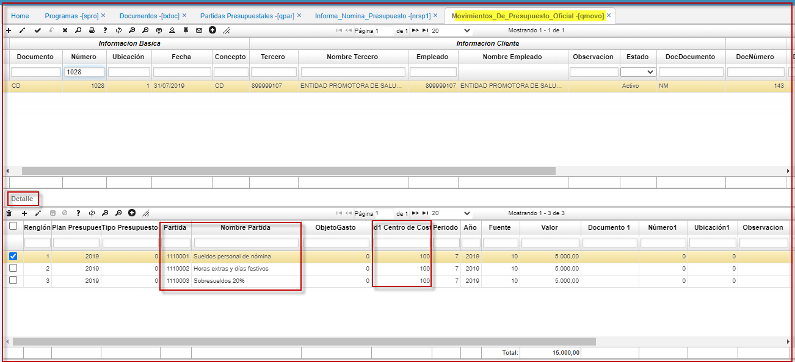
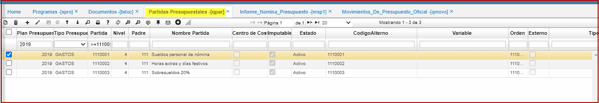

# Informe Nomina - Presupuesto - NRSP1

Reporte relaciona informacion de movimiento de presupuesto oficial con un documento de nomina (NM, AP o PV) y su respectiva partida presupuestal.  
Migracion reporte NRSP de version, se crea nueva opcion NRSP1.  
Resumen presupuestal de la nomina por centro de costo; extrae informacion del **QMOVO**.  Movimientos de presupuesto Oficial.  

  

**QMOVO**.  Movimientos de Presupuesto Oficial.  

  

Partidas presupuestales.  **QPAR.**  

  

