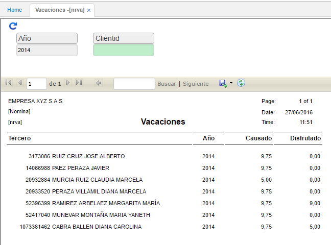

# VACACIONES - NRVA

Este reporte permite ver los datos almacenados en la opción **NVAC**, muestra los periodos de disfrute y causados de los diferentes empleados. También permite filtrar por un empleado en específico.

