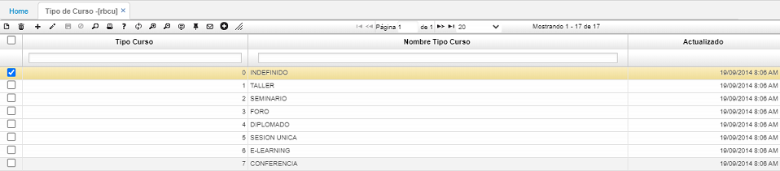

# TIPO DE CURSO - RBCU  

Corresponde a la relación de todos los cursos que imparte la empresa a sus empleados.   

Se realiza adicionando un registro (+) asignando un código y la descripción del curso en el campo _Nombre_.  

