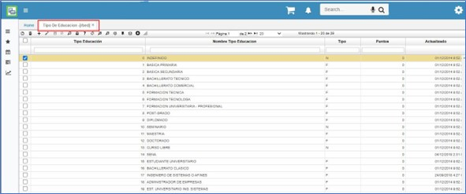

# TIPO DE EDUCACIÓN - RBED  

Se definen los niveles de educación que puede tener un empleado. Ejemplo: Bachillerato, formación universitaria, diplomado, etc.  

Se realiza adicionando un registro asignando un código y la descripción del tipo de educación en el campo _Nombre Tipo Educación_, adicional a esto a cada uno se le indica si es de _Tipo_ formal o no formal.  Para el sector público, permite asignar un puntaje de acuerdo a cada tipo de educación.  Por último, se guarda el registro.  

