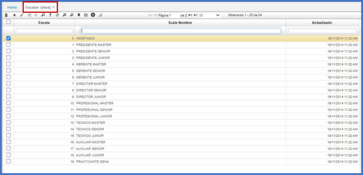

# Escalas - RBES  

Definición de las diferentes escalas salariales que tenga la compañía.  

Se realiza adicionando un registro (+) y asignando un código y la descripción de la escala salarial en el campo _Scale Nombre_.  Por último, se guarda el registro.  

