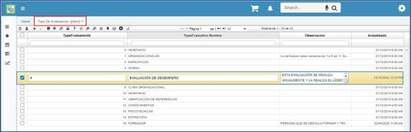

# Tipo de evaluación - RBEV  

Definición de las diferentes evaluaciones que considere realizar la compañía a sus empleados.  

Se realiza adicionando un registro, se asigna un código y la descripción de la evaluación en el campo _TypeEvaluation Nombre_.  Por último, se guarda el registro.  

  

