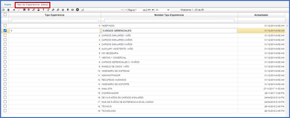

# TIPO DE EXPERIENCIA - RBEX  

Clasificación de las áreas o campos laborales en que se han desempeñado los empleados. 

Se realiza adicionando un registro (+) asignando un código y la descripción del tipo de experiencia en el campo _Nombre Tipo Experiencia_.  

