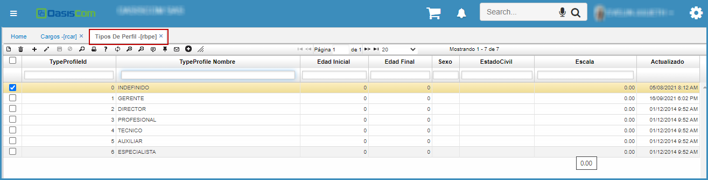

# TIPOS DE PERFIL - RBPE  

Se definen las características generales de los perfiles para los diferentes cargos.

Esto se realiza adicionando un registro (+) asignando un código, la descripción del cargo en el campo _TypeProfile Nombre_.  
Se define el rango de edades para cada uno en los campos _Edad Inicial_ y _Edad Final_, el _Sexo_, el _Estado Civil_ y la _Escala_ salarial.  

