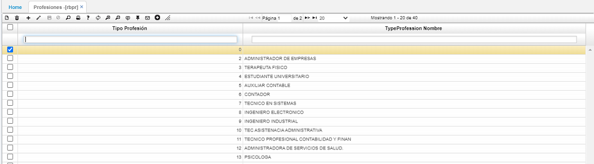

# PROFESIONES - RBPR  

En esta aplicación se pueden definir la variedad de profesiones que presentan los empleadosy/o aspirantes de la compañía. 

Se realiza adicionando un registro (+) y asignando un código y la descripción de la profesión en el campo _TypeProfession Nombre_.  Por último, se guarda el registro.  

