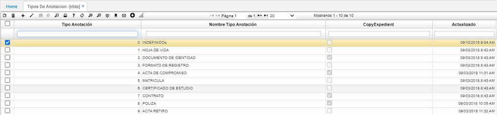

# TIPOS DE ANOTACION - RBTA  

Registro de los tipos de anotaciones que puede recibir un empleado proveniente de cualquier instancia superior, entre estas cuentan las amonestaciones, felicitaciones, sanciones, y todas aquellas observaciones positivas y/o negativas que ameritan llevar un histórico.  

Esto se realiza adicionando un registro (+), asignando un código, la descripción de la anotación en el campo _Nombre Tipo Anotación_ y la  indicación si esta va con copia al expediente del empleado en el campo _Copy Expedient_.  Por último, se guarda el registro.  

