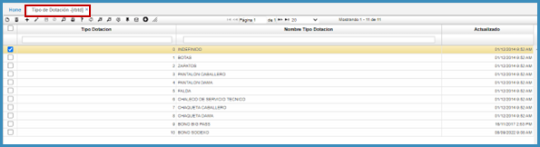

# TIPO DE DOTACION - RBTD  

Corresponde al registro de los elementos definidos como dotación de los empleados para la realización de sus actividades laborales.  
Se realiza adicionando un registro y asignando un código y la descripción del tipo de dotación en el campo _Nombre Tipo Dotación_.  Por último, se guarda el registro.   

  

