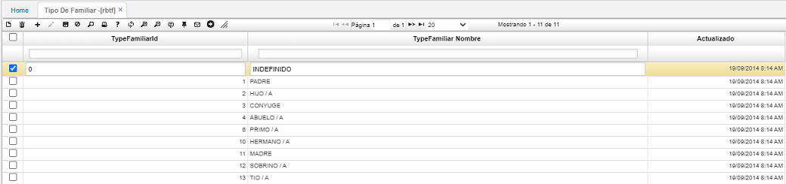

# Tipo de familiar - RBTF  

Es la definición de los tipos de parentesco familiar. 

Se realiza adicionando un registro y asignando un código y la descripción del tipo de parentesco familiar en el campo _TypeFamiliar Nombre_.  Posteriormente, se procede a guardar el registro. 

