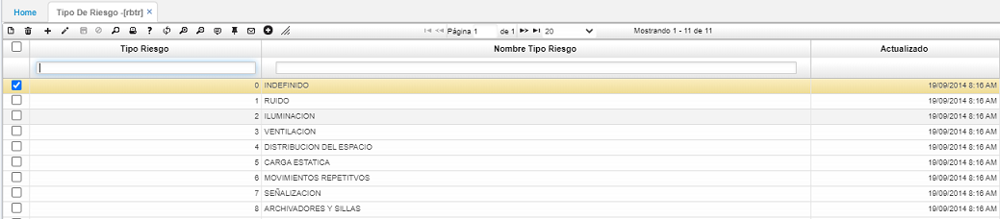

# TIPO DE RIESGO - RBTR  

Es el registro de todos los riesgos a los que están expuestos los empleados de las diferentes áreas.  

Se realiza adicionando un registro y asignando un código y la descripción del riesgo en el campo _Nombre Tipo Riesgo_.  Posteriormente, se procede a guardar el registro.  

