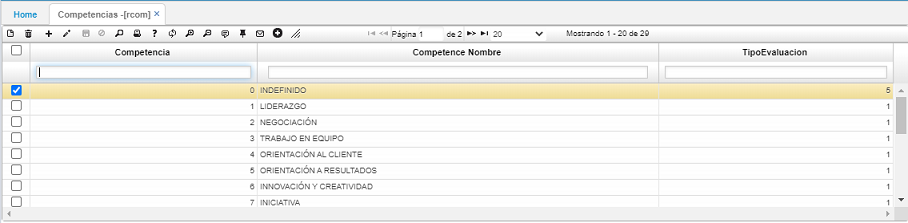
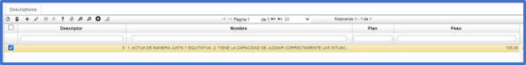

# Competencias - RCOM  

En esta aplicación, se definen todas y cada una de las competencias evaluadas para el alcance de los objetivos individuales y de la organización.  

Para registrar cada una de las competencias, se adiciona un registro (+) asignándole un código y la descripción puntual de la misma en el campo _Nombre_. El _Tipo de Evaluación_ se parametriza en la aplicación **Tipo de Evaluación - RBEV**. 

 

En la parte inferior, en el detalle, se puede hacer un listado describiendo cómo son las competencias de la persona.  El campo _Descriptor_ es para el consecutivo y en el campo _Nombre_ se hace un resumen de las competencias que tiene cada prospecto o empleado. El campo _Plan_ se diligencia en ciertos casos, por ejemplo, si la empresa tiene _Plan de Carrera_ y finalmente el campo _Peso_ es el peso que se le coloca a cada consecutivo.  

 

