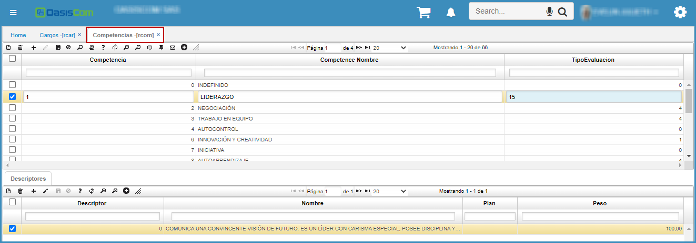

# COMPETENCIAS - RCOM  

En esta aplicación, se definen todas y cada una de las competencias evaluadas para el alcance de los objetivos individuales y de la organización.  

Para registrar cada una de las competencias, se adiciona un registro (+) asignándole un código y la descripción puntual de la misma en el campo Nombre.  

  

