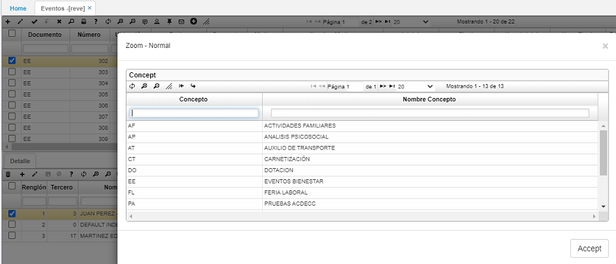
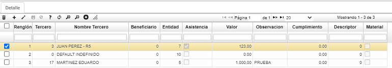

# Eventos - REVE  

Este registro se realiza especificando los datos básicos del evento como lo es tipo, rango de fechas en que se llevara a cabo, proveedor y costo total del evento.  En el campo _Documento_ hay un zoom y en él se escoge la opción **_EE_** de Eventos y en el campo _Concepto_ también se escoge la opción **_EE_** de Eventos Bienestar.  Se guarda el registro.

Posteriormente, en el detalle del evento se relacionan los asistentes o inscritos al mismo, por lo tanto se debe indicar en el campo Asistencia ()si fue efectiva o ( ) no. Para los casos en que la actividad sea financiada en conjunto empresa-empleados, se indica el valor aportado por cada empleado y en el campo  _Valor_ y las observaciones a que haya lugar.  

