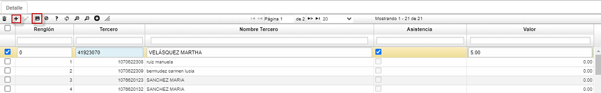

# CAPACITACION - RCAP

En la aplicación **RCAP**, realizaremos el registro de las capacitaciones de la organización. Iniciaremos ingresando a la aplicación **RCAP – Capacitación** y adicionaremos un nuevo registro.

**Documento**: seleccionamos (_ET_) referente a Capacitación de RRHH.  
**Ubicación**: seleccionamos del zoom nuestra ubicación, la cual debe estar previamente parametrizada en la aplicación **BUBI – Ubicaciones Organizacionales**.  
**CourseId**: digitamos o seleccionamos del zoom el código perteneciente al curso parametrizado anteriormente en la aplicación **RCUR – Cursos**.  
**TeacherId**: digitamos el número de identificación de la persona que dictará la capacitación o ingresamos al zoom y la seleccionamos.  

En la parte inferior de la aplicación, en el detalle, registraremos todos los invitados a la capacitación.  

Adicionamos un nuevo renglón, en el campo _tercero_ digitamos o consultamos en el zoom el número de identificación de la persona a registrar, seguidamente, en el campo _asistencia_ activamos el flag en caso de que la persona haya asistido a la capacitación, de lo contrario no, y por último en el campo _valor_ digitamos una nota evaluativa, es decir, la nota que obtuvo la persona que asistió a la capacitación.  

