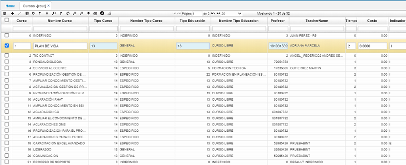
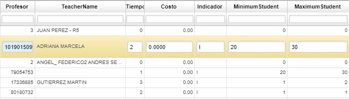
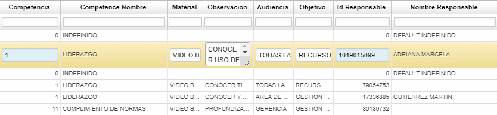

# CURSOS - RCUR

La aplicación **RCUR – Cursos**, permite registrar los cursos planeados para el mes. Para iniciar, ingresamos a la aplicación **RCUR** y parametrizamos los cursos previstos.

Agregamos un nuevo registro y diligenciamos los campos correspondientes:  

**Course Id**: diligenciar el código que se le asignará al curso.  
**Course Name**: nombre del curso que se registra. 
**Type Course Id**: ingresar el código del tipo de curso que se registra. Los tipos de cursos deben estar previamente parametrizados en la aplicación **RBCU – Tipos de Cursos**.  

Allí se ingresa el código que se le asignará al tipo de curso y el nombre. Es importante recordar que no se deben repetir los códigos, de ser así el sistema arrojará un mensaje de control.  

**Type Education Id**: ingresamos el código del tipo de educación. Los tipos de educación deben estar previamente parametrizados en la aplicación **RBED – Tipos de Educación**.  

En los siguientes campos:

**Teacher Id**: diligenciar el número de identificación de la persona que estará a cargo del curso.  
**Minimum Student**: número mínimo de estudiantes que realizarán el curso.  
**Maximum Student**: número máximo de estudiantes que pueden realizar el curso.  

**Competencia**: Código de la competencia que será reforzada con el curso. Las competencias deben estar previamente parametrizadas en la aplicación **RCOM – Competencias**.  
**Material**: materiales que serán utilizados para la ejecución del curso.  
**Audience**: Personal al cual va dirigido el curso.  
**Id Responsable**: seleccionar del zoom, el número de identificación de la persona responsable del curso.  

Diligenciados todos los campos correspondientes al curso, guardamos el registro dando click en el botón _guardar_ del maestro.  

