# CARGOS - RCAR

La aplicación RCAR – Cargos, permite crear los cargos a los cuales se les va a realizar el proceso de selección en la empresa.  
 
Inicialmente, agregaremos una nueva fila en el maestro y diligenciaremos los datos correspondientes al cargo al cual se le realizará proceso de selección. 

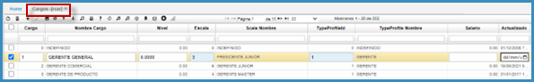

Los campos del maestro de la aplicación los diligenciaremos de la siguiente manera:

**Cargo**: digitar el consecutivo del cargo que se está registrando.  
**Nombre cargo**: nombre del cargo al cual se le realizará proceso de selección.  
**Escala**: número de escala en la cual se encuentra el cargo. La escala se debe parametrizar previamente en la aplicación RBES – Escalas.  
**Tipo de perfil**: digitar el número de tipo de perfil profesional que deben tener los aspirantes al cargo registrado. Los tipos de perfil se parametrizan en la aplicación _RBPE – Tipos de perfil_.  

Diligenciados los anteriores campos del maestro, damos clic en _guardar_ y continuamos con las pestañas del detalle.

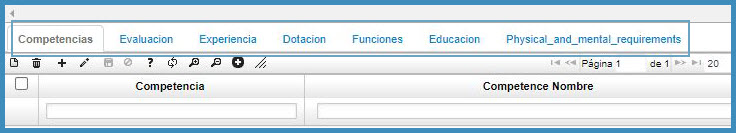

**Pestaña Competencias**

Las competencias deben estar previamente parametrizadas en la aplicación _RCOM – Competencias_.

En la pestaña _Competencias_, se diligencian las competencias que deben poseer los aspirantes al cargo.

**Competencia**: damos doble clic y seleccionamos del zoom la competencia que aplique al cargo que se registró en el maestro. Se pueden insertar todas las competencias que requiera el cargo.

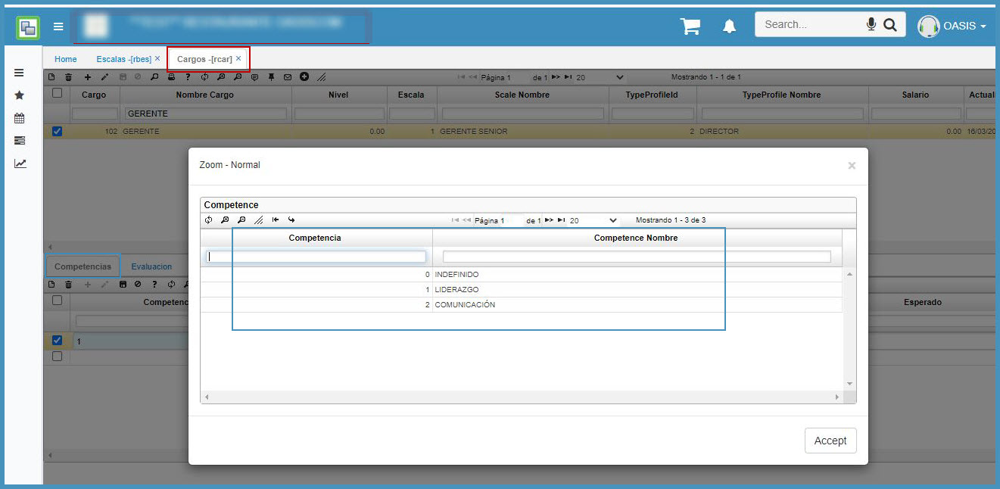

**Peso**: digitar el peso que tiene la competencia que se va a evaluar.  
**Expectativa**: digitar el porcentaje de cumplimiento esperado.

Digitamos estos campos damos click en _guardar_ y nos dirigimos a la siguiente pestaña del detalle _Evaluación_.

**Pestaña evaluación**

Los tipos de evaluación deben ser previamente parametrizados en la aplicación _RBEV – Tipos de evaluación_.

En la pestaña _Evaluación_ del detalle, agregamos un nuevo registro y damos doble click en el zoom del campo _tipo de evaluación_, allí seleccionamos el tipo de evaluación que aplicará al cargo registrado en el maestro y damos clic en _aceptar_.

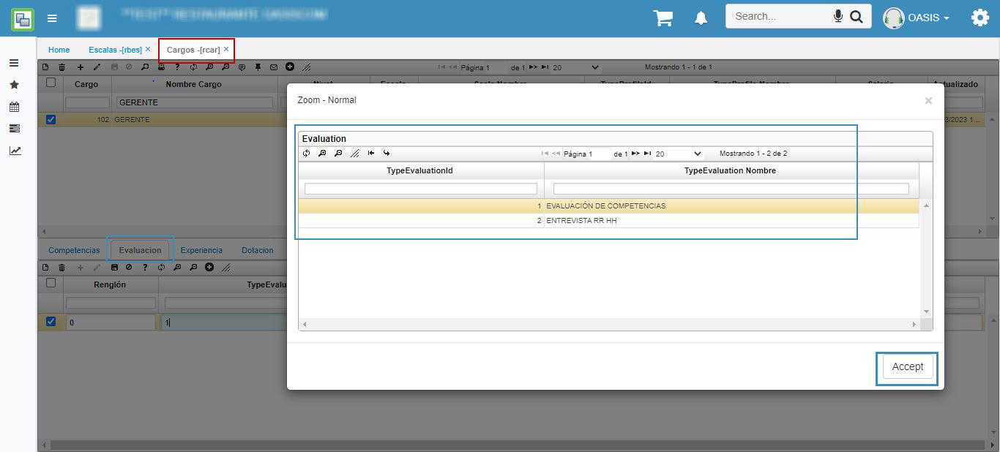

Seguidamente, en el campo _peso_ diligenciaremos el peso que tiene el tipo de evaluación seleccionado.

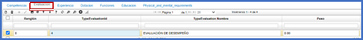

**Pestaña experiencia**

Los tipos de experiencia deben ser previamente parametrizados en la aplicación RBEX – Tipos de experiencia.

En la pestaña _Experiencia_ del detalle, agregamos un nuevo registro y damos doble click en el zoom del campo _tipo de experiencia_, allí seleccionamos el tipo de experiencia que deben tener los aspirantes al cargo registrado en el maestro y damos clic en _aceptar_.

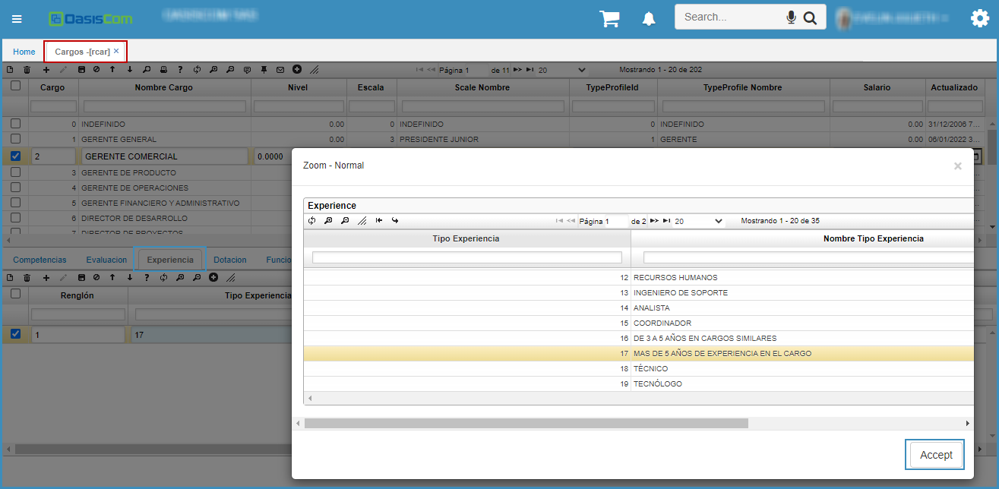

Seguidamente, en el campo _peso_ diligenciaremos el peso que debe tener el tipo de experiencia en el proceso de selección.

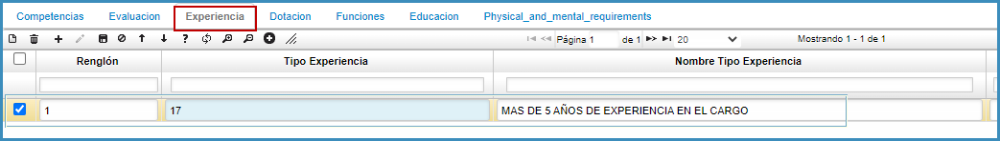

**Pestaña Dotación**

El tipo de dotación se debe parametrizar previamente en la aplicación _RBTD – Tipo de dotación_.

En la pestaña _Dotación_, se diligencia el tipo de dotación que se le suministrará al contratado periódicamente y la cantidad, en caso de que no se realice entrega de dotación, omitir esta pestaña.

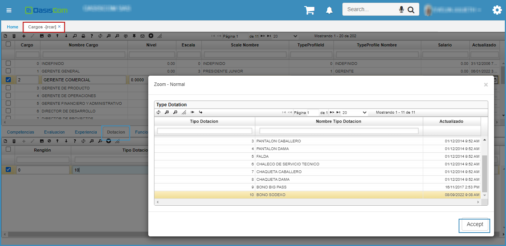

**Pestaña Funciones**

La pestaña _funciones_ no requiere de ninguna parametrización previa, simplemente se diligencian las funciones que se desempeñarán en el cargo registrado en el maestro.

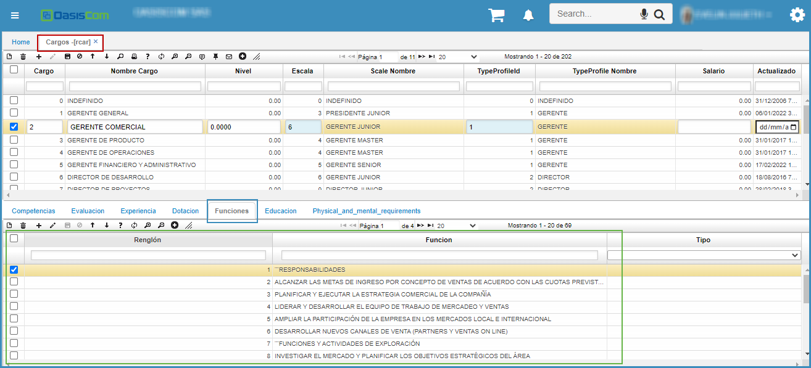

**Pestaña Educación**

El tipo de educación se debe parametrizar previamente en la aplicación RBED – Tipo de educación.

En la pestaña _educación_, seleccionaremos del zoom el tipo de educación que se solicita posea el aspirante al cargo.

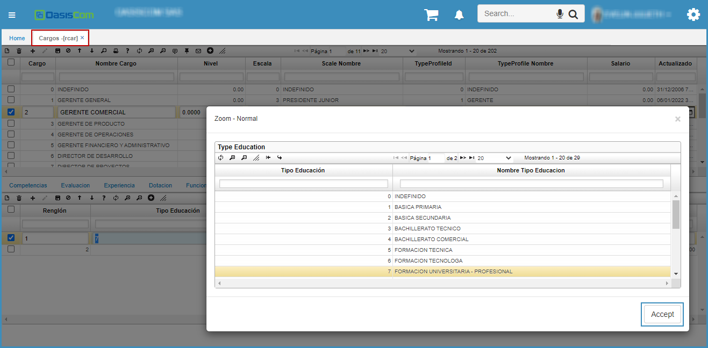

Finalmente, en el campo _peso_, digitamos el peso que tiene el tipo de educación en el proceso de selección.

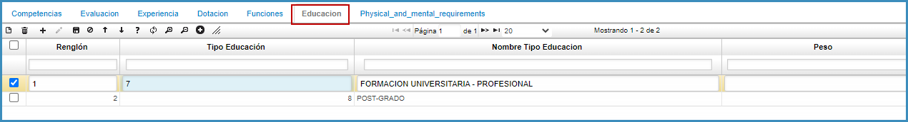

Diligenciada la información de cada pestaña de la aplicación **RCAR – Cargos**, finaliza el proceso de creación de un cargo en OasisCom.

